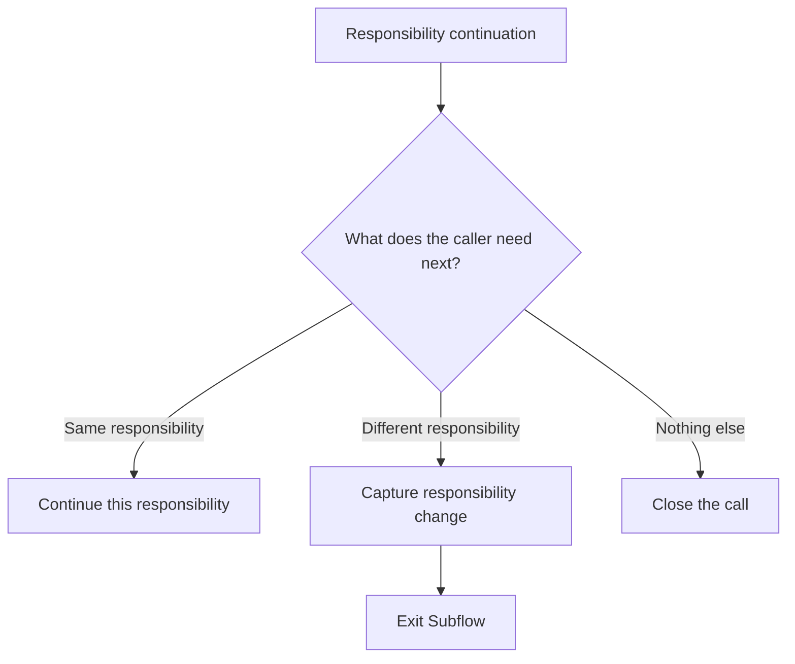
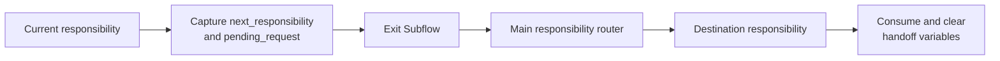

# Retell Variable and Routing Risk Audit

The graph itself was structurally valid—no dangling edges or unreachable
nodes—but the audit found several runtime risks. The local `v74` build now
implements the corrections below. It has passed local configuration tests and
typechecks; it has not been deployed, provider-verified, called, or simulated.

## Deterministic Extraction Correction — v74

The published `v73` intake call showed that a Subagent prompt transition could
win before its owned Extract Dynamic Variable tool ran. The caller said
“existing order,” but `primary_route` remained unset, so the main router used
its fallback and entered General Knowledge.

Release `v74` removes that race throughout the flow:

- conversational Subagents no longer own Extract Dynamic Variable tools;
- a prompt transition first enters a dedicated Extract Dynamic Variables node;
- equation transitions validate the captured value before routing or invoking
  an operational tool;
- missing intake and human-escalation classifications return to their owning
  question rather than defaulting to another responsibility;
- order identifiers, callback contacts, shipment email, support contacts,
  existing-order action selection, and responsibility handoffs all use this
  boundary; and
- General Knowledge and Existing Order knowledge answers no longer use an
  automatic Skip User Response transition into the continuation question.

The full conversation history remains available. Dedicated extraction exists
only for values that downstream routing or tools must consume deterministically.

## Implemented Runtime Corrections

1. Shipment and contact lookups now remove provider data at the HTTP boundary
   before returning the tool result to Retell. Retell receives only `ok`,
   `result_code`, and `safe_summary`; the complete result still reaches private
   internal persistence.

2. Shared `confirmed_phone` and `confirmed_email` state is removed. Callback,
   shipment, support, and order lookup use separate purpose-specific variables.

3. Persistent tool-result status variables are removed. Function nodes route
   from the current tool result, so a previous success cannot control a later
   invocation.

4. Verified and unverified support writes use separate tools. The global human
   fallback never binds `order_candidate_token`; Existing Order requires it
   only on its verified-order write.

The remaining audit findings are also implemented:

- Responsibility changes and different-order selection clear verified-order
  state before leaving or restarting Existing Order.
- A genuine order lookup failure uses the system-failure follow-up path; only a
  successful `not_found` result asks for a different identifier.
- Callback failure speech no longer claims the team was notified when that
  outcome is not guaranteed.
- A silent initial code node derives `caller_phone_last_four`; spoken prompts
  no longer receive the full caller number.
- Unused response variables were removed from the Retell configuration.

Not a problem: the repeated-action idempotency keys include a request hash in the database, so a second callback or shipment email with different details will not incorrectly replay the first request.

Implementation source of truth: `retell/build-config.ts` and
`src/entrypoints/http/retell-tool-routes.ts`.

## Agreed Routing Architecture

These are the routing decisions agreed after the audit and implemented in the
local `v74` candidate. They are not confirmation that the live Retell agent has
been updated.

### Responsibility ownership

- New Project, Existing Order, and General Knowledge each remain focused,
  multi-turn subflows.
- Follow-up questions about the same responsibility stay inside the current
  subflow. They do not return to the main intake router.
- Each responsibility has one controlled continuation and exit area:
  - another question about the same responsibility stays in the subflow;
  - a clear change to another responsibility uses the responsibility-handoff
    exit;
  - no additional request proceeds to call closure.
- We will not add an exhaustive responsibility-change transition to every node.
  Extra escape points should be added only where real calls show that callers
  commonly change responsibilities before reaching the normal continuation
  point.

### Responsibility handoff

When a caller clearly changes responsibilities, the local handoff exit captures:

- `next_responsibility`: `new_project`, `existing_order`, or `general`;
- `pending_request`: a concise representation of the caller's new request.

The full conversation history remains available, so `pending_request` is a
one-time routing handoff rather than a duplicate transcript. The current
subflow then uses its explicit Exit Subflow node. The main flow routes by
`next_responsibility`, and the destination subflow consumes and immediately
clears both handoff variables.

This design does not restore `current_context`. There is no continuously
maintained responsibility-state variable.

### Global nodes and Go Back

Retell does not document a global node scoped only to one subflow. A subflow has
an explicit Exit Subflow node, so each responsibility uses a local exit
coordinator rather than a broad global responsibility router.

Global nodes are reserved for genuinely universal interruptions:

- an explicit request for a human uses the global human-escalation path and
  does not Go Back after transfer or fallback completion;
- a named-employee request may Go Back only when the transfer is abandoned and
  the AI should resume the exact previous step;
- DNC remains an initial-intake route rather than a mid-call global;
- changing orders or moving among New Project, Existing Order, and General
  Knowledge is a permanent responsibility handoff, not a Go Back interruption.

Go Back is used only for a temporary interruption after which returning to the
exact previous node is correct. It restores the graph location, but it does not
roll back dynamic variables changed during the global handler.

| Situation | Go Back decision |
| --- | --- |
| Named employee request | Use Go Back only if the transfer is abandoned and the AI should resume the exact interrupted step. |
| One-question General Knowledge detour | May use Go Back only when the detour changes no operational variables and the caller should resume the interrupted step. |
| Human escalation | Never. Complete the transfer or its fallback path. |
| Different order | Never. Selecting another order changes the active order state and token. |
| New Project, Existing Order, or General Knowledge responsibility change | Never. Use the controlled responsibility handoff. |
| DNC | Never. Keep it at initial intake. |
| Callback or support outcome | Never. Continue forward to the owning responsibility's normal continuation question: “Is there anything else I can help you with?” |

After a callback or support operation reaches its defined success or failure
outcome, the continuation path decides what happens next:

- another request in the same responsibility stays in that subflow;
- a different responsibility captures the handoff variables and exits;
- nothing else closes the call politely.

It must not return to the step that initiated the callback or support action,
because that could repeat the conversation or execute the operation again.

### Retell guidance boundary

Retell recommends global nodes for universal scenarios, focused subflows with
clean entry and exit points, and node-level transitions for cases specific to
the current step. Retell also warns that additional prompt conditions make the
correct transition harder to select.

Retell does **not** specifically recommend placing the same responsibility
switch on every interactive node. The controlled local handoff described above
is our GenStone architecture, chosen to avoid both broad global re-entry and an
exhaustive transition matrix.

Relevant Retell documentation:

- [Global nodes](https://docs.retellai.com/build/conversation-flow/global-node)
- [Transition conditions](https://docs.retellai.com/build/conversation-flow/transition-condition)
- [Reusable subflows](https://docs.retellai.com/build/conversation-flow/components)
