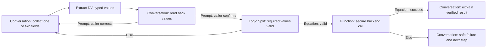

# Retell Conversation Flow Reference

Research date: 2026-08-07

This is the design reference for choosing Retell Conversation Flow nodes,
edges, tools, and advanced features. It covers every page listed under
`/build/conversation-flow/` in Retell's official
[documentation index](https://docs.retellai.com/llms.txt) on the research date.

For the exact GenStone graph, variables, components, tool bindings, and tests,
use the [Retell agent build specification](./retell-agent-build-spec.md). This
file explains platform mechanics and is not the node-by-node build checklist.

## Design Decision

Use a rigid Conversation Flow agent as the GenStone default. It gives us
explicit paths, predictable tool execution, inspectable transitions, and
node-level tuning. Do not enable Flex Mode for the initial agent. Flex Mode
compiles a flow into a single large prompt, ignores node-level knowledge bases,
discourages equation edges, and can become less reliable beyond 20 nodes.

Use these rules:

1. Use **Conversation nodes** for dialogue that does not need a tool.
2. Use **Extract DV nodes** immediately after meaningful intake to capture
   typed values from the conversation.
3. Read sensitive identifiers back in a **Conversation node** and obtain caller
   confirmation before a lookup or write.
4. Use **Function nodes** for guaranteed backend calls, especially every
   authenticated lookup or state-changing action.
5. Use **Subagent nodes** only when dialogue and an optional, narrowly scoped
   read tool genuinely belong together.
6. Use **Logic Split nodes** and equation edges for exact, typed state.
7. Use prompt edges only for meaning that must be interpreted from speech.
8. Give every split a safe fallback path. A failed lookup must never become a
   made-up answer.
9. End every completed path with a caller-facing summary and an **End node**.
10. Treat human approval boundaries as routing rules, not suggestions.

## Node Selection Matrix

| Retell capability | What it does | GenStone decision | Use when | Do not use when |
| --- | --- | --- | --- | --- |
| Conversation node | Multi-turn dialogue without tools; prompt or static first sentence | **Core** | Greeting, intent intake, data collection, confirmation, explaining a verified result, closing | A tool must execute in the same step |
| Subagent node | Multi-turn dialogue where the LLM chooses whether and when to call attached tools | **Selective** | Narrow, read-only product or knowledge lookup where the caller may ask several related questions | A tool must always run, the action changes state, or several unrelated tools would be attached |
| Extract DV node | Silently extracts Text, Number, Enum, or Boolean values from prior dialogue | **Core** | After intake, before confirmation, and before deterministic routing | As a substitute for asking the caller for missing information |
| Function node | Executes exactly one function on entry | **Core** | Contact, employee, order, shipment or case lookup; case creation; scheduling; suppression; or any required backend action | The tool is optional and depends on a later caller question |
| Code node | Runs JavaScript in Retell's QuickJS sandbox | **Not initial** | Low-risk formatting or calculation with no secrets, if a backend route would add no value | Authentication, secrets, PII-sensitive logic, production writes, or retryable business actions |
| SMS node | Sends SMS on entry from an eligible number | **Out of scope** | Only after a separate SMS use is explicitly approved | Communication preference is merely being recorded, photos need follow-up, or email/callback already handles the outcome |
| MCP node | Calls one tool on a remote MCP server on entry | **TBD** | Only if Bradford establishes a production MCP gateway with authentication, audit, and stable contracts | Direct access to broad internal tools or when a narrow custom function is safer |
| Call Transfer node | Transfers to a person/number using standard warm transfer, human detection, and a private whisper | **Core for named employees** | The caller independently requests one employee and Salesforce returns one unique Active User with a direct number | A generic human request, department request, ambiguous match, or missing number. An attempted transfer failure returns to the agent, explains the failed connection, and follows the primary route: new-project callback or existing-order Zendesk. |
| Transfer Agent node | Near-instant swap to another Retell agent with conversation history | **Future** | A separately owned specialist or language agent is justified | The same flow can handle the task, or the destination is a human |
| Press Digit node | Silently navigates an IVR using DTMF | **Not initial** | A future outbound workflow must navigate a known external IVR | Normal inbound GenStone customer calls |
| End node | Terminates the call, optionally after a closing message | **Core** | Every completed, declined, wrong-number, no-response, or safely failed path | Before the agent has stated the next step |
| Logic Split node | Immediately branches on conditions without speaking | **Core** | Exact branching on confirmed variables or backend result codes | The caller still needs to clarify natural-language intent |
| Subflow | Reusable group of nodes with a defined entry and exit | **Core** | Identity capture, confirmation, case intake, callback, and closure patterns used across intents | One-off logic or deeply nested composition; subflows cannot contain subflows |
| Global node setting | Makes a node reachable after any user turn when a universal condition matches | **Core, limited** | Human request, caller wants to end, correction request, or abusive/unsafe interaction | Ordinary intent routing or silence detection |
| Flex Mode | Compiles flow or subflow into a single prompt with dynamic task navigation | **Deferred** | A proven, bounded subflow needs context switching after rigid-flow tests fail | Initial production agent, equation-heavy routing, node-level KB needs, or a flow above 20 nodes |

## Function Node Versus Subagent Node

| Question | Function node | Subagent node |
| --- | --- | --- |
| Who decides to run the tool? | The graph; it always runs on entry | The LLM decides from the conversation |
| Number of tools | One | Multiple, although fewer is safer |
| Can it hold a normal dialogue? | No | Yes |
| Best GenStone use | Confirmed identifier → guaranteed lookup/write | Optional read-only lookup during a focused dialogue |
| State-changing actions | Preferred, with idempotency | Avoid |
| Result handling | Wait for result, branch on typed result, then explain in a Conversation node | Result can be discussed inside the same node |

Default to a Function node. A Subagent node needs an explicit reason.

## Transition Policy

Retell evaluates transitions in this order: Always edge, equation conditions
top-to-bottom, prompt conditions together with global-node conditions, Else
edge, then stay in the current node.

| Situation | Transition type | Reason | GenStone example |
| --- | --- | --- | --- |
| Exact dynamic variable or backend result | Equation | Deterministic and testable | `{{lookup_status}} == "found"` |
| Required value is present or absent | Equation | No language interpretation needed | `{{order_number}} exists` |
| Typed enum selected by Extract DV | Equation | Closed vocabulary | `{{primary_intent}} == "existing_order"` |
| Caller expresses intent, confirms, denies, corrects, or asks for a person | Prompt | Meaning comes from natural speech | `Caller says the read-back is incorrect` |
| Universal human-handoff or end request | Global prompt condition | Must work from most dialogue nodes | `Caller clearly asks to speak with a person` |
| Function success/failure | Equation on stored response variables | Never let the LLM infer success | `{{tool_ok}} == "true"` |
| No expected branch matched | Else | Safe fallback | Ask a focused clarification or create a human message |
| Exact non-interactive preface | Skip Response edge | No caller response is needed | Say a fixed transition line before a future approved action |
| One reply is enough regardless of its content | Always edge, rarely | Skips all condition evaluation | Acknowledgement-only training step; not identity confirmation |

### Equation Rules

- Equations can use dynamic variables only. Extract a value first if it was
  learned during the call.
- String comparisons are exact; numeric comparisons fail safely when a value
  is empty or non-numeric.
- An empty string still counts as existing. Validation cannot rely on `exists`
  alone.
- One equation condition can contain up to 50 equations combined with ANY or
  ALL.
- Order matters: the first true equation edge wins.
- In Flex Mode, Retell recommends prompt edges instead of equation edges. This
  is another reason not to use Flex Mode initially.

### Fallback Rules

- Do not put a broad Else edge directly after open-ended intake if staying in
  the node would allow the caller to finish.
- Use Else after deterministic splits and tool results so every failure has a
  destination.
- Tool fallback order is: retry only when safe and idempotent, ask for a second
  identifier when useful, then use the primary route's follow-up—new-project
  callback or existing-order Zendesk.
- Never convert a timeout, empty result, or tool error into a positive answer.

## Dynamic Variable Pattern

The standard identity-and-action sequence is:

The agent should not read back a whole record of PII. Confirm only the minimum
needed identifier, such as the order number and masked email domain.

## Tool Execution And Security Rules

- Custom functions call a publicly reachable backend URL using GET, POST, PUT,
  PATCH, or DELETE. Prefer POST for structured, validated requests.
- Verify `X-Retell-Signature` against the exact raw request body before parsing.
- Retell documents its current outbound IP as `100.20.5.228`; IP allowlisting
  may be defense in depth, not a replacement for signature verification.
- Keep Retell credentials in backend secrets. Do not put credentials in Code
  nodes, dynamic variables, metadata, or query strings.
- Retell custom-function requests can include the call object and transcript.
  Prefer a minimal args-only body when full call context is unnecessary.
- Return small structured JSON with explicit fields such as `ok`, `result_code`,
  `safe_message`, and opaque record IDs. Retell caps the result given to the LLM
  at 15,000 characters by default.
- Map only the response variables needed for the next branch.
- Custom functions do not retry by default. Retell can retry up to five times,
  including on 4xx responses. Enable retries only for idempotent operations.
- A caller interruption does not cancel an in-flight custom function. Every
  state-changing endpoint must therefore be idempotent.
- Use Wait for Result whenever the next node depends on the outcome.
- Explain the result in a Conversation node after deterministic branching.

## Global Settings Relevant To GenStone

| Setting | Initial direction |
| --- | --- |
| Language | English first; add a language only with an approved support path |
| Global prompt | Brand, tone, privacy, no-card-data rule, approval boundaries, and universal safety rules only |
| Knowledge base | Approved GenStone catalog/policy content; do not treat stale webpages as live inventory or order data |
| Responsiveness | Start at the GenSteel baseline `0.7`; validate with older callers and noisy retail environments |
| Interruption sensitivity | Start at the GenSteel baseline `0.6`; validate against talking over callers and store background speech |
| Backchanneling | Leave unset/Retell default initially; it controls brief listening acknowledgements and their frequency |
| Boosted keywords | Initially unset; add a small tested list of GenStone, product/color names, retailer names, spoken SKU patterns, carriers, and commonly requested employee names |
| Pronunciation dictionary | Initially unset; add only tested and business-confirmed pronunciations for brands, product terms, acronyms, or names |
| Speech normalization | Enable and test for order numbers, phone numbers, dates, money, and addresses |
| Silence reminder | Leave trigger/count unset to use Retell default; a reminder is a spoken check-in after caller inactivity |
| End on silence | `50,000 ms`; silence does not trigger a Global node |
| Maximum duration | `600,000 ms` |
| Privacy/storage | Retell storage mode is `Everything`. Archive the exact webhook body in private R2 and store its key plus normalized state in PlanetScale. Keep Retell, R2, and PlanetScale records with no automatic deletion. |
| Webhook | Signed provider events only; processing must be idempotent |
| Post-call analysis | Primary intent, outcome, escalation reason, handoff quality, and QA fields after the flow stabilizes |

## Reusable Subflows

The GenStone API build uses dedicated versioned shared subflows because Retell
returns stable ids for shared subflows but not for embedded local definitions.
Shared updates can change already-published agents, so each GenStone release
creates new ids, never edits an existing subflow, and never reuses these
subflows across agents.

Proposed subflows:

- `Classify Caller Intent`
- `Collect And Confirm Contact`
- `Collect And Confirm Order Identifier`
- `Resolve And Transfer Named Employee`
- `Schedule Centralized GenStone Callback`
- `Collect Support Context For Follow-Up`
- `Summarize Next Step And Close`
- `DNC And Administrative Closure`

Each subflow needs one clear job, a defined start, an Exit Subflow end node, and
descriptive node names. Subflows cannot contain other subflows.

For GenStone, the callback subflow collects a next-business-day-or-later,
non-holiday Monday-Friday time between 8:30 AM and 4:30 PM Mountain Time and
sends the request through Customer.io to managers. It does not query or reserve
an individual employee calendar. Generic human requests, department requests,
ambiguous or failed named-person transfers, and agent-initiated escalations use
this subflow only when the primary route is a new project. On an existing
order, they use Zendesk. A named employee with one Active Salesforce User and
direct phone number first uses the Call Transfer node. See
the [human handoff and callback decision](./human-handoff-and-callbacks.md).

## Testing And Debugging Rules

- Name nodes by action and outcome because Retell history shows transitions by
  node name.
- Test every expected edge, the Else edge, interruption during tool execution,
  timeouts, malformed identifiers, duplicate writes, and delivery failure.
- If a node misses fields or hallucinates, split it before adding more prompt
  text.
- If a transition is wrong, make its condition observable and specific, then
  add a short transition example from a real or synthetic transcript.
- Conversation and Subagent nodes support response and transition examples;
  Function nodes support transition examples.
- Global-node examples must end with a user turn and include both jump and
  do-not-jump cases.
- Avoid numbered instruction labels such as `PRIORITY 1`; Retell warns they can
  be confused with transition choices. Use descriptive labels or letters.
- Use node-specific stronger models only where testing proves the simpler model
  is insufficient.

## Complete Official Page Inventory

All 22 pages below were reviewed. The note records the part most relevant to
the GenStone design.

| # | Official page | Relevant extraction |
| --- | --- | --- |
| 1 | [Overview](https://docs.retellai.com/build/conversation-flow/overview) | Conversation Flow gives finer control than Single/Multi Prompt; flows can be reused across agents, so shared changes require staged testing. |
| 2 | [Global settings](https://docs.retellai.com/build/conversation-flow/global-setting) | Voice, language, model, prompt, KB, speech, privacy, webhooks, silence, duration, and post-call analysis are configured at agent scope. |
| 3 | [Nodes and edges](https://docs.retellai.com/build/conversation-flow/node) | Complete node taxonomy, edge types, naming, and guidance to split complex nodes. |
| 4 | [Conversation node](https://docs.retellai.com/build/conversation-flow/conversation-node) | Multi-turn dialogue without tools; split on logic changes or long instructions. |
| 5 | [Subagent node](https://docs.retellai.com/build/conversation-flow/subagent-node) | Dialogue with LLM-chosen tools; multiple tools increase wrong-tool risk. |
| 6 | [Function node](https://docs.retellai.com/build/conversation-flow/function-node) | Guaranteed tool call on entry; wait for result and use a later Conversation node to explain it. |
| 7 | [Custom function](https://docs.retellai.com/build/conversation-flow/custom-function) | External API contract, response variables, raw-body HMAC verification, retries, interruption behavior, and idempotency requirements. |
| 8 | [Code node](https://docs.retellai.com/build/conversation-flow/code-node) | Secretless QuickJS only; no automatic retry; authenticated or state-changing work belongs in the backend. |
| 9 | [Call transfer node](https://docs.retellai.com/build/conversation-flow/call-transfer-node) | Phone-only cold, warm, and agentic warm transfer; explicit failure edge and optional human detection/whisper. |
| 10 | [Press Digit node](https://docs.retellai.com/build/conversation-flow/press-digit-node) | Silent IVR navigation with success, loop, wrong-destination, and voicemail transitions. |
| 11 | [End node](https://docs.retellai.com/build/conversation-flow/end-node) | Terminal node; enable a closing message to avoid abrupt hang-up. |
| 12 | [Logic Split node](https://docs.retellai.com/build/conversation-flow/logic-split-node) | Immediate silent branch; always includes Else. |
| 13 | [SMS node](https://docs.retellai.com/build/conversation-flow/sms-node) | Sends on entry and branches on delivery result; number approval and content rules vary by sender type. |
| 14 | [Extract DV node](https://docs.retellai.com/build/conversation-flow/extract-dv-node) | Extracts Text, Number, Enum, or Boolean values; it does not converse. |
| 15 | [Transfer Agent node](https://docs.retellai.com/build/conversation-flow/transfer-agent-node) | AI-to-AI swap preserves history and avoids telephony transfer latency; initial privacy settings stay pinned to the first agent. |
| 16 | [MCP node](https://docs.retellai.com/build/conversation-flow/mcp-node) | Calls one remote MCP tool and can map response variables; production gateway controls are not defined by the page. |
| 17 | [Transition conditions](https://docs.retellai.com/build/conversation-flow/transition-condition) | Prompt versus equation, exact evaluation order, special edges, equation operators, and transition debugging. |
| 18 | [Reusable subflows](https://docs.retellai.com/build/conversation-flow/components) | Local versus shared subflows, no nested subflows, controlled entry/exit, variable reuse, and published-agent update risk. |
| 19 | [Flex Mode](https://docs.retellai.com/build/conversation-flow/flex-mode) | Dynamic task switching at higher prompt cost; ignores node KB, prefers prompt edges, and warns about flows over 20 nodes. |
| 20 | [Global node](https://docs.retellai.com/build/conversation-flow/global-node) | Universal user-turn triggers, optional return to prior node, positive/negative examples, and re-trigger cooldown. |
| 21 | [Finetune examples](https://docs.retellai.com/build/conversation-flow/finetune-examples) | Short transcript examples can correct responses and transitions; global examples have a distinct user-turn rule. |
| 22 | [Debug guide](https://docs.retellai.com/build/conversation-flow/debug-guide) | Diagnose node instruction, transition, and off-graph failures separately; split nodes and add global paths for inbound support deviations. |
