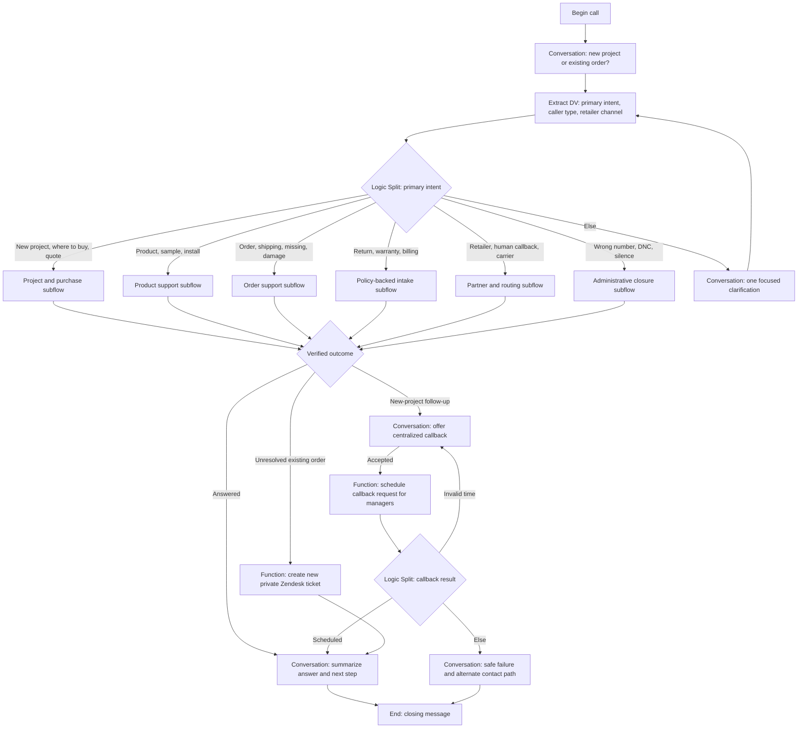
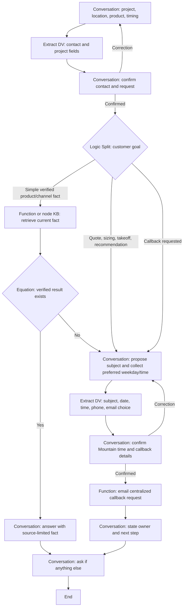
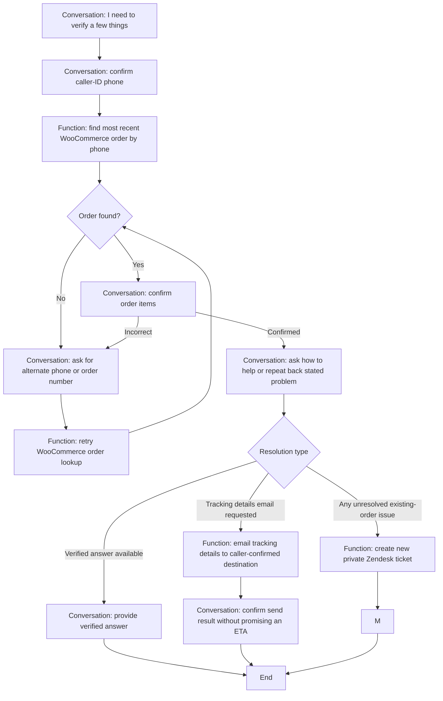

# GenStone Extended Capability Examples

> This file preserves detailed discovery examples. It is not authoritative and
> does not create a separate flow, tool, or launch requirement. Use the
> [GenStone capability map](./genstone-capability-map.md) for current behavior.

Status: discovery map, not an approved launch scope or implemented agent

Source behavior comes from the reviewed GenStone call transcripts and confirmed
stakeholder decisions. Notion is a generated layer and is not treated as source
evidence. The agent may answer verified facts and perform simple intake and
routing, but it may not invent or approve quotes, product fit, returns, refunds,
replacements, warranties, billing exceptions, or safety conclusions.

## Initial Scope Rule

The launch design follows a small set of driving principles:

1. Begin with: “Thank you for calling GenStone. Are you calling about a new
   project or existing order?”
2. Every existing-order request enters the same verification path before the
   agent discusses or acts on the order.
3. Answer with approved information or verified WooCommerce data. Otherwise,
   collect only the context needed for human follow-up.
4. A new prospect not found in Salesforce uses the confirmed internal prospect
   follow-up to Travis; other new-project follow-up uses centralized callback
   scheduling. Every unresolved existing-order request uses the general
   Zendesk path; never schedule an existing-order callback.
5. Never expose “case” or “ticket” terminology. For Zendesk follow-up, say the
   team will be in touch as soon as possible.
6. Record phone, email, or text preferences as fields on the existing follow-up;
   do not create separate communication-method scenarios.
New visualizer project photos are separate from support evidence and use the
public `genstone.com/visualizer` page.

The detailed capabilities below are coverage examples. They must collapse into
the shared verification, answer, email-follow-up, and Zendesk-case paths—not
separate tools or conversation flows for every issue label.

## Existing-Order Verification Path

1. Tell the caller: “Before we continue, I need to verify a few things.”
2. Confirm the caller-ID phone number.
3. Exclude quote-status drafts and look up the most recent actual WooCommerce
   order by phone or exact order number.
4. When found, confirm the items on the order.
5. When no order is found, ask for a different phone number or the order number,
   look it up, and confirm the matching order.
6. Ask how the agent can help with the order. If the caller already explained
   the problem, repeat it back and confirm it instead of making them start over.
7. When the caller asks when a tracked delivery will arrive, share only the
   verified WooCommerce shipment fields. If requested, send the provider,
   tracking number(s), approved carrier link(s), and stored shipped date to the
   caller-confirmed destination email. Ask for and confirm that destination only
   after the caller accepts the email offer. Do not infer an ETA or delivery state.

This is one reusable gate for status, shipment, damage, claims, returns,
warranties, receipts, payment questions, and every other existing-order intent.

## Capability Gap Capture

When a legitimate request cannot be completed because the agent lacks approved
knowledge, policy, system access, or a supported action:

1. Use the normal centralized follow-up path for the caller.
2. Do not tell the caller that the agent lacks a capability or that a case was
   created. Explain only that the details were sent to the team and what will
   happen next.
3. Record an internal capability-gap signal through post-call analysis or
   webhook processing. This must not require a separate caller-facing flow.

Capture only:

- call ID;
- primary intent and requested outcome;
- a short factual summary;
- gap category: `missing_knowledge`, `missing_policy`, `missing_data`,
  `missing_integration`, `unsupported_action`, or `tool_failure`;
- whether the centralized follow-up succeeded.

Use these signals to review recordings, count repeated gaps, and prioritize the
next knowledge or tool improvement. Do not copy the full transcript into the
gap record by default.

## Recommended Agent Shape

Build one inbound Conversation Flow agent with:

- a small main router;
- dedicated versioned GenStone subflows grouped by customer goal;
- deterministic backend functions for live data and every write;
- global paths for human requests, caller corrections, and ending the call;
- one centralized GenStone callback flow for new-project follow-up;
- one general Zendesk follow-up flow for unresolved existing-order work and
  route-aware transfer failures;
- no Flex Mode in the first production version.

This is not a single-prompt or multi-prompt design. The historical GenSteel
review agent also used Conversation Flow, but its prompts and review campaign
behavior are not the basis for this GenStone agent.

## Master Flow

## Universal Caller Instructions

These apply across every capability:

- Use the GenStone brand and ask only whether the call concerns a new project or
  an existing order.
- Ask one question at a time.
- Capture exactly one primary intent; add secondary tags separately.
- Route every existing-order caller through the shared WooCommerce verification
  path before discussing the order.
- Confirm only values needed for the current action. Use the last four digits
  for initial phone confirmation, confirm a shipment-email destination once,
  and do not read tracking numbers aloud.
- Never collect full card data, CVV, passwords, or authentication codes.
- Do not claim a callback, follow-up request, case, or lookup succeeded
  unless a tool returned a success code.
- A clean handoff is a successful resolution when the requested decision
  belongs to a human.
- State what happens next without promising an unverified callback time,
  approval, delivery date, refund, replacement, or price.
- Internally flag legitimate requests the agent could not resolve as capability
  gaps; this does not create a different caller-facing path.
- For callbacks, propose and confirm a subject, preferred weekday/time, and
  callback phone. GenStone callbacks are next business
  day or later, excluding standard U.S. federal holidays, Monday through Friday
  from 8:30 AM-4:30 PM Mountain Time.

Human follow-up scheduling follows the stakeholder-confirmed
[human callback decision](./human-handoff-and-callbacks.md).

## Capability Matrix

The node sequences below name node roles, not final dashboard node names.
`C` = Conversation, `X` = Extract DV, `L` = Logic Split, `F` = Function,
`S` = Subagent and `E` = End.

| # | Capability and required intake | Retell path | Transition design | Tools | Allowed resolution and boundary |
| --- | --- | --- | --- | --- | --- |
| 1 | **New project or purchase help.** Name, phone, email, caller type, ZIP, product/use, and a short description. | `C intake → F Salesforce contact lookup → C confirm → F prospect follow-up or callback → C result → E` | A confirmed caller not found in Salesforce uses the unmatched-prospect internal follow-up; other follow-up uses the callback path. | Salesforce contact lookup; unmatched-prospect internal email; centralized callback scheduling. | Answer verified process facts when possible. Never create a Salesforce Lead or Contact during the call and never email the prospect from these internal follow-up tools. |
| 2 | **Where to buy, supplier, showroom, local availability.** City/state/ZIP, product/color, and retailer checked. | `C intake → optional F catalog lookup → C answer or F callback → E` | A failed or unavailable lookup falls back to follow-up. | Confirmed catalog lookup; centralized callback scheduling. | State only verified channels. Never guess live store inventory. |
| 3 | **Project sizing, quote, price, material takeoff.** Contact, ZIP, product/color, project summary, and timing. | `C intake → X → C confirm → F callback → C next step → E` | No automated quote, project record, or upload flow. | Centralized callback scheduling. | Note that photos are available when relevant; the human follow-up provides submission instructions. |
| 4 | **Product catalog question.** Product family, color, SKU/model, and exact question. | Verified FAQ: `C → E`. Live data: `C → F product lookup → C answer or F callback → E`. | Use only approved content or confirmed data. | Confirmed product lookup; centralized callback scheduling. | Project-specific fit, code, safety, and discontinued-product questions go to follow-up when not explicitly verified. |
| 5 | **Samples, brochures, literature, color, visualizer.** Contact, caller/store, product/color, order number if known, and issue. | Sample order: `C → F WooCommerce order lookup → C answer or F Zendesk → E`. New visualizer: `C → C provide public page → E`. | Samples are existing orders and use Zendesk when unresolved. New project images go to `genstone.com/visualizer`; new-project page questions use callback follow-up when needed. | WooCommerce order lookup; approved public knowledge; Zendesk or new-project callback according to the primary route. | The Visualizer page is for project renderings, not support evidence. Do not promise rendering timing or submit the form for the caller. |
| 6 | **Installation, use, care, technical support.** Product, project stage, exact question, and purchase channel/order. | Approved guidance: `C → E`. Anything else: `C intake → F callback or case → E`. | Safety or project-specific questions always use follow-up unless the answer is explicitly approved. | Approved knowledge; email callback or Zendesk case according to the ownership rule. | Keep caller-provided issue details as ordinary context. |
| 7 | **Existing order status, shipping, delivery, tracking.** Confirmed order number or phone, purchase channel, and requested status. | `C confirm identifier → F order/shipment lookup → C verified result, optional F tracking email, or F Zendesk → E` | Lookup failures and unsupported questions use Zendesk. Ask for and confirm an email destination only when the caller accepts a shipment email. | Confirmed WooCommerce order/shipment lookup; Customer.io tracking-details transactional email; Zendesk follow-up. | Present only returned status. Email provider, tracking number(s), approved carrier link(s), and stored shipped date when available. Never infer an ETA, delivery state, or partial shipment, and never expose another customer's order. |
| 8 | **Existing-order problem needing resolution.** This includes missing, wrong, damaged, defective, return, refund, cancellation, exchange, RGA, warranty, and similar requests. | `C shared verification → C confirm issue → F Zendesk case → C next step → E` | One decision: does the request require tracked human ownership and resolution? If yes, create one general support case. | WooCommerce verification and one general Zendesk case action. | Do not create issue-specific flows, expose case terminology, or promise correction, replacement, approval, or refund. |
| 11 | **Billing, payment, receipt, card, discount, promotion, checkout.** Contact, order if any, and a safe issue description; no card data. | Existing order: `C safe intake → F order lookup → F Zendesk → E`. New project: `C → F callback → E`. | No receipt or payment-link action without owner confirmation. | Confirmed WooCommerce lookup; route-appropriate Zendesk or callback. | Never collect card details or promise refunds, exceptions, or payment timing. |
| 12 | **Retailer, store, Pro Desk, contractor, distributor.** Store/company, caller role, store number, PO/order/SKU, and issue. | `C intake → optional F confirmed WooCommerce lookup → F Zendesk → E` | Historical agents collected retailer context; current unresolved retailer-order work uses Zendesk. | WooCommerce when the order is present there; otherwise existing-order Zendesk follow-up. | Minimize customer data and do not imply access to a retailer system. |
| 13 | **Named person or previous Project Coordinator.** Caller/contact, employee name if volunteered, and order/project context. | `C confirm named transfer → F employee lookup → T warm transfer → route-aware fallback`. | The agent does not ask the caller to select a person. Transfer failure returns to new-project callback or existing-order Zendesk. | Salesforce employee lookup; Retell warm transfer; route-appropriate follow-up. | Do not claim the employee is available or expose the direct number. |
| 14 | **Carrier, FedEx, UPS, logistics, misdelivered package.** Carrier, tracking, issue, and caller/company details. | `C intake → optional F shipment lookup → F Zendesk → E` | Restricted or unavailable existing-order information uses Zendesk. | Confirmed shipment lookup; Zendesk follow-up. | Share only authorized information. Never disclose unrelated customer details. |
| 15 | **Wrong number, DNC, unwanted call, missed/returned call, vendor, test, unrelated.** Phone and caller statement; vendor context only if legitimate. | Wrong/unrelated: `C clarify once → E`. Missed/returned call: `C intake → F follow-up → E`. DNC: `C confirm number → optional F suppression or F follow-up → E`. | Historical agents did not search call history; they recorded the caller's statement and passed it to the team. | Confirmed DNC suppression or centralized follow-up. | Do not claim to know who called without a verified lookup. Keep unrelated calls short. |
| 16 | **Silent, no response, foreign-language-only, bad connection.** No business fields unless caller becomes understandable. | `C greeting/retry once → End-on-silence setting or E with closing`. Supported language may route to future Transfer Agent. | Silence is handled by agent call settings, not a Global node. Prompt edge only when audible speech identifies language or connection issue. | Call disposition only; future language transfer. | Retry once, state the audio problem, and close without a lead/case. Do not guess intent from unusable audio. |

## Project And Purchase Flow

## Shared Existing-Order Flow

## Partner, Human Callback, And Administrative Flow

```mermaid
flowchart TD
    A["Conversation: classify retailer, human callback, carrier, DNC, or unrelated"] --> B["Extract DV"]
    B --> C{"Logic Split: administrative intent"}
    C -->|"Retailer or carrier"| D["Conversation: collect store, PO, SKU, tracking, role"]
    D --> E["Function: confirmed lookup or centralized follow-up"]
    C -->|"Generic human request"| J{"Logic Split: primary route"}
    J -->|"New project"| P["Function: schedule callback request for managers"]
    J -->|"Existing order"| Q["Function: create new private Zendesk ticket"]
    C -->|"DNC"| K["Conversation: confirm number"]
    K --> L["Function: suppress number"]
    C -->|"Wrong, test, silent, unrelated"| M["Conversation: brief closure"]
    E --> N["Conversation: next step"]
    P --> N
    Q --> N
    L --> N
    M --> O["End"]
    N --> O
```

## Global Nodes And Call-Level Controls

| Universal scenario | Mechanism | Destination behavior |
| --- | --- | --- |
| Caller clearly asks for a human | Global Conversation node | Do not ask the caller to choose a person, team, or department. A named employee uses transfer. Otherwise follow the primary route: new project → callback; existing order → Zendesk. |
| Caller says a confirmed value is wrong | Global Conversation node with return-to-previous enabled | Ask which value is wrong, return to the intake step, prevent immediate re-trigger |
| Caller wants to end or says goodbye | Global End node | Brief closing, then end |
| Caller starts sharing card data | Global Conversation safety node | Interrupt politely, say not to provide card data, route to secure billing process |
| Threat, abuse, or unsafe interaction | Global Conversation/End path | One warning when appropriate, then safe close or human escalation |
| Silence/no response | Agent end-on-silence setting | Retry once and close; Global nodes only evaluate after a user turn |
| Tool failure | Local equation/Else edge | Do not make this global; each tool has a capability-specific safe fallback |

## Human Decision Boundary

The following outputs may be captured or routed by the agent but never decided
by an LLM transition or unvalidated tool response:

- quote approval, sales judgment, material takeoff, and project feasibility;
- product recommendation, fit, fire/heat/clearance, structural, or code advice;
- return, RGA, refund, cancellation, exchange, or replacement approval;
- warranty coverage or damage/defect determination;
- billing disputes, payment exceptions, discount, promotion, free-shipping,
  price-match, wholesale, distributor, or national-account decisions;
- disclosure of personal employee or customer information.

The backend must return an explicit authority level such as `information_only`,
`intake_allowed`, `human_review_required`, or `approved_by_policy_engine`.
The agent must not turn `intake_allowed` into approval language.
