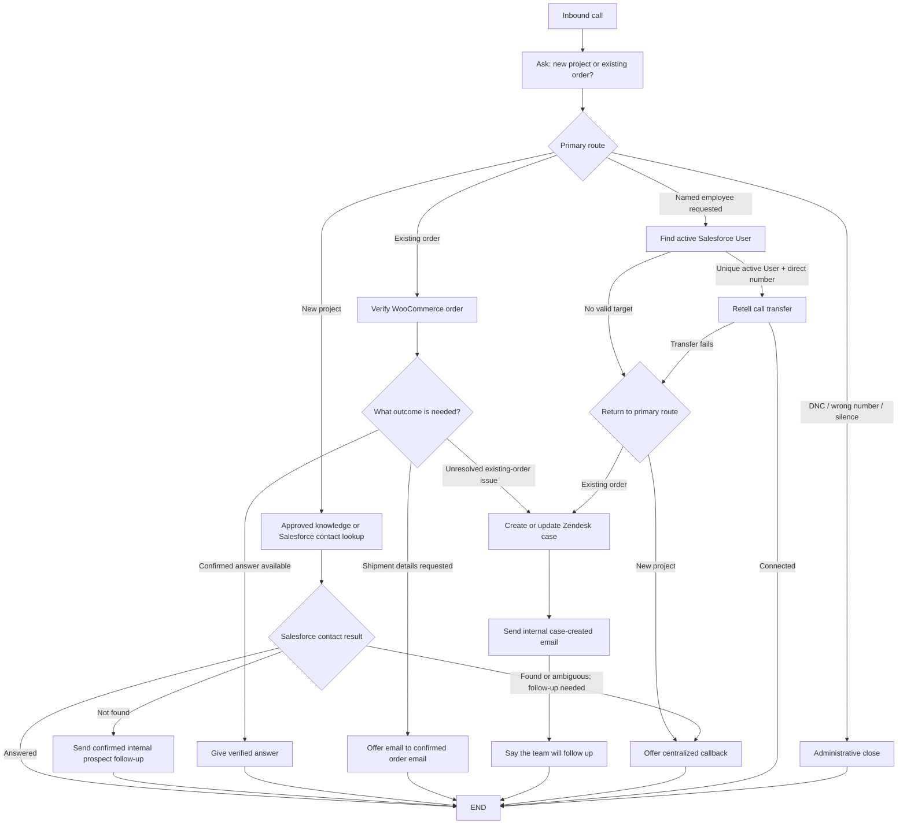

# GenStone Capability Map

This is the authoritative conversation-path map. It is intentionally organized
around a few reusable outcomes rather than a separate path for every topic.
Extended examples are preserved in
[Capability examples](./genstone-capability-examples.md), but they do not add
launch requirements.

## Driving Principles

- Start with: “Thank you for calling GenStone. Are you calling about a new
  project or an existing order?”
- Do not encourage callers to choose a department or employee.
- The opening classification determines the follow-up system: new projects use
  the Salesforce contact lookup followed by the prospect or callback path;
  existing orders use the verified-order and Zendesk paths.
- Reuse the same verification, direct-answer, callback, and tracked-support
  outcomes across topics without inventing topic-specific flows.
- Answer only from approved knowledge or confirmed tool results.
- A new prospect not found in Salesforce uses the confirmed internal prospect
  follow-up to Travis. Other new-project follow-up uses the callback path.
- An existing-order issue the agent cannot resolve uses Zendesk, followed by an
  internal case-created email. Do not schedule an existing-order callback.
- If the agent cannot handle something yet, capture the caller's request and
  relevant context in the appropriate existing follow-up path.
- Never tell the caller that an internal email, case, ticket, Lead, or Contact
  was created.

## Master Flow

## Existing-Order Verification

Before discussing an existing order:

1. Confirm the caller's phone number.
2. Look up the most recent WooCommerce order by that number.
3. If found, confirm the order items and order email.
4. If not found, ask for another phone number or the order number and confirm
   the matching order.
5. Then ask how the agent can help. If the caller already explained the issue,
   repeat it back instead of making them start over.

This same gate applies to status, shipping, damage, claims, returns, warranties,
missing or wrong items, samples, receipts, and other order questions.
Retailer-context orders use the same phone or numeric WooCommerce-order lookup
when GenStone has a normal WooCommerce record; unresolved existing-order
requests use the same Zendesk outcome.

## Reusable Outcomes

### Direct answer

Give a concise answer from approved public knowledge or confirmed system data.
Do not guess about live inventory, delivery dates, eligibility, approval, or a
future outcome.

### Shipment email

If a verified caller asks when the shipment will arrive or asks for tracking,
offer to email the stored shipment details. Confirm the order email and send
only to that address. Include only verified carrier/provider, tracking number,
approved tracking link, and stored shipped date. If authoritative delivery or
ETA data is unavailable, say so and use follow-up when needed.

### Callback / internal email

For a confirmed new prospect whose Salesforce contact lookup returns
`not_found`, send the internal unmatched-prospect follow-up to Travis. This
does not create a Salesforce Lead or Contact and does not email the caller.

Use the callback path for other new-project follow-up, including a generic
human request made in the new-project route. Callbacks are next business day or
later, Monday through Friday, 8:30 AM-4:30 PM Mountain time. Record
communication preferences as ordinary context, not as separate paths. Never
offer callback scheduling for an existing-order issue.

### Zendesk support

Use one Zendesk path for every existing-order issue the agent cannot resolve
during the call. The topic may be a return, warranty, claim, damage, missing
item, wrong item, or something else; these labels do not create separate
conversation paths.

Create one new private answering-service ticket for each confirmed unresolved
existing-order call, then send the internal case-created email. Do not search,
compare, select, or update an earlier ticket during the call. Tell the caller
the customer service team will respond by the end of the next business day; do
not expose case terminology or offer an appointment time.

### Named-person transfer

Only use this when the caller independently names an employee. Find one unique
active Salesforce User and use that person's direct number in Retell's Call
Transfer node. If the lookup is ambiguous, the number is missing, or transfer
fails, tell the caller the connection could not be completed and return to the
primary route: new projects use callback scheduling and existing orders use
Zendesk. “Active” is directory eligibility, not proof of current availability.

## Capability Gap Capture

When the agent reaches an unsupported question:

1. Preserve the caller's exact request and the context already collected.
2. Choose the outcome from the primary route: callback for a new project or
   Zendesk for an existing order.
3. Do not invent a new tool, upload flow, channel, or caller scenario.
4. Log the gap for later transcript review without promising that a new feature
   will be built.

## Conversation Flow Shape

Use one Retell Conversation Flow agent. Prefer a small number of conversation,
function, logic-split, global, transfer, and end nodes. Universal interruption
handling, such as a human request, may use a global node, but it must return to
the same outcomes above.

Use the [Retell agent build specification](./retell-agent-build-spec.md) for the
exact node inventory, variables, tool mappings, transitions, and test matrix.
