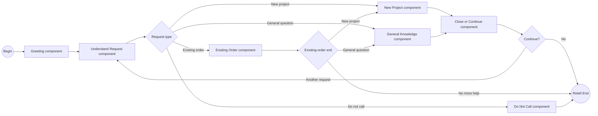
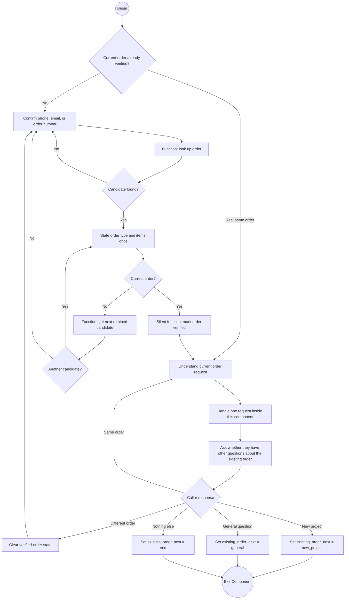
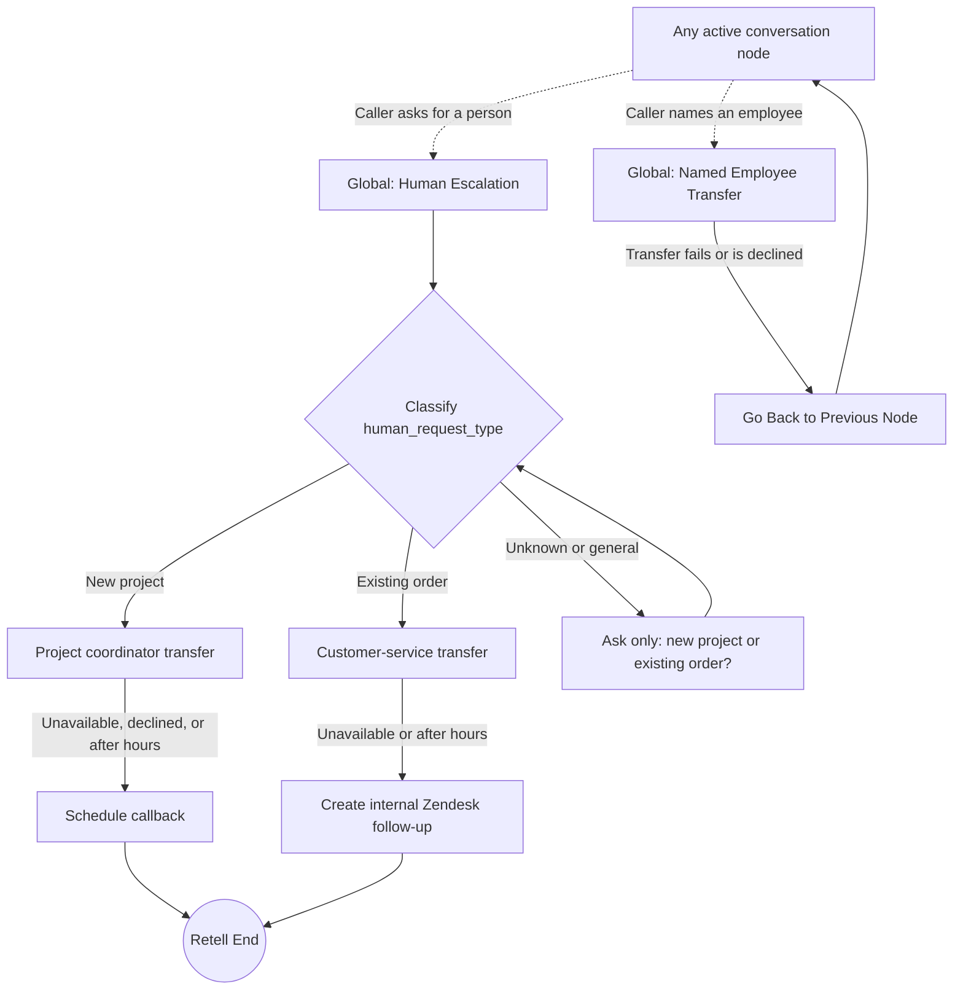

# GenStone Capability Map

This is the authoritative conversation-path map. It is intentionally organized
around a few reusable outcomes rather than a separate path for every topic.
Extended examples are preserved in
[Capability examples](./genstone-capability-examples.md), but they do not add
launch requirements.

## Driving Principles

- Start with: “Thank you for calling GenStone. Who do I have the pleasure of
  speaking with?” Then ask whether the call concerns a new project or an
  existing order.
- Do not encourage callers to choose a department or employee.
- The opening classification determines the handoff: new projects use the
  project-coordinator transfer or callback path; existing orders use verified
  WooCommerce data, direct answers, shipment handling, or customer service.
- Reuse the same verification, direct-answer, callback, and customer-service
  outcomes across topics without inventing topic-specific flows.
- Answer only from approved knowledge or confirmed tool results.
- A new project transfers to the project coordinator during business hours.
  After hours, on the web, after a declined transfer, or after a failed
  transfer, use the callback path.
- An existing-order issue the agent cannot resolve uses Zendesk, followed by an
  internal case-created email. Do not schedule an existing-order callback.
- If the agent cannot handle an existing-order request, offer customer-service
  transfer during business hours and create the Zendesk follow-up when live
  transfer is unavailable.
- Never tell the caller that an internal email, case, ticket, Lead, or Contact
  was created.

## Master Flow

The main canvas contains only broad business responsibilities. Do-not-call is
an ordinary intake classification, not a mid-conversation global interruption.
Shipment, customer-service escalation, contact lookup, and Zendesk follow-up
are internal nodes of the Existing Order component, not separately connected
main-flow components. Components never connect to another component's internal
nodes.

The Existing Order component keeps same-order and different-order continuation
inside itself. It exits only when the caller changes to a new project, asks a
general question, or has nothing else to discuss.

The detailed internal diagrams for New Project, General Knowledge, global
interruptions, and the call-wide state contract live in the
[Retell agent build specification](./retell-agent-build-spec.md).

## Existing-Order Component

`Handle one request` may use internal conversation, knowledge, function, logic,
and transfer nodes for shipment, direct answers, customer-service escalation,
contact lookup, and Zendesk follow-up. Those details stay off the main canvas.

## Existing-Order Verification

Before discussing an existing order:

1. Begin with the caller-ID phone's last four digits when appropriate, but
   accept a caller-confirmed phone, exact billing email, or order number.
2. Exclude quote-status drafts and find eligible WooCommerce candidates using
   that identifier.
3. If found, identify a stored sample or explicitly signaled retail order and
   confirm the order items.
4. Store all candidates from the successful search once. If the first is
   rejected, move through the retained candidates without another provider
   lookup.
5. After the retained set is exhausted, accept whichever new supported
   identifier the caller has. If no candidate can be confirmed, use Customer
   Service Handoff without attaching a rejected order.
6. Then help with the issue already stated. Ask what they need only when they
   have not explained it yet; do not make them repeat it or recite it back.

This same gate applies to status, shipping, damage, claims, returns, warranties,
missing or wrong items, samples, receipts, and other order questions.
Retailer-context orders use the same phone or numeric WooCommerce-order lookup
when GenStone has a normal WooCommerce record; unresolved existing-order
requests use the same Zendesk outcome.

## Reusable Outcomes

### Direct answer

Give a concise answer from approved public knowledge or confirmed system data.
Do not guess about live inventory, delivery dates, eligibility, approval, or a
future outcome.

### Shipment email

If a verified caller asks when the shipment will arrive or asks for tracking,
give a concise spoken summary without reading tracking numbers aloud, then
offer to email the stored shipment details. Confirm the complete destination
email; accept a different caller-provided address after reading it back once.
The email includes only verified carrier/provider, tracking number, approved
tracking link, and stored shipped date. If authoritative delivery or ETA data
is unavailable, say so without guessing.

### Callback / internal email

Use the callback path when a project-coordinator transfer cannot happen or is
declined. Callbacks are next business day or later, Monday through Friday,
8:30 AM-4:30 PM Mountain time. Record
communication preferences as ordinary context, not as separate paths. Never
offer callback scheduling for an existing-order issue.

### Zendesk support

Use one Zendesk path for every existing-order issue the agent cannot resolve
during the call. The topic may be a return, warranty, claim, damage, missing
item, wrong item, or something else; these labels do not create separate
conversation paths.

The first unresolved issue in a call creates one private answering-service
ticket and sends the internal case-created email. Related information supplied
later in that same call is appended as a private comment. Do not search,
compare, select, or update tickets from earlier calls. Tell the caller
the team will be in touch as soon as possible; do not expose case terminology
or offer an appointment time. The internal email is not a customer email. The
customer service team's internal response expectation remains the end of the
next business day.

Keep support brief. Ask one open question when the issue needs more detail;
for damage, ask “What was broken?” without listing the order items again. Reuse
verified identity and order context. After the write, use the single approved
team-follow-up sentence and close normally.

### Named-person transfer

Only use this when the caller independently names an employee. Find one unique
active Salesforce User and use that person's direct number in Retell's Call
Transfer node. If the lookup is ambiguous, the number is missing, or transfer
fails, tell the caller the connection could not be completed and return to the
established conversation context. “Active” is directory eligibility, not proof
of current availability.

## Capability Gap Capture

When the agent reaches an unsupported question:

1. Preserve the caller's exact request and the context already collected.
2. Choose the outcome from the primary route: callback for a new project or
   Zendesk for an existing order.
3. Do not invent a new tool, upload flow, channel, or caller scenario.
4. Log the gap for later transcript review without promising that a new feature
   will be built.

## Conversation Flow Shape

Use one Retell Conversation Flow agent. Prefer a small number of conversation,
function, logic-split, global, transfer, and end nodes. Universal interruption
handling, such as a human request, may use a global node.

Call-wide dynamic variables carry only minimal deterministic state between the
main flow and components. Use the owning exit enum (`new_project_next`,
`existing_order_next`, or `knowledge_next`), `order_verified`, and
`order_candidate_token`. When responsibility changes, capture one
`pending_request`; the destination owner consumes and clears it immediately. A
same-order or different-order choice stays inside Existing Order.

Retell already supplies the active conversation history to the current
conversation or subagent node. Do not maintain an appended call summary or an
`active_request_summary` routing variable. When a callback or support write
needs a factual summary, the owning node creates that one tool argument from
the existing conversation at execution time.

Do not use a global node for an ordinary responsibility change. Global nodes
are reserved for universal human interruptions:

- A generic request for a person permanently enters Human Escalation. It
  classifies `human_request_type` once from the conversation, asking new project
  or existing order only when unclear. It then chooses project
  transfer/callback or customer-service transfer/Zendesk and completes the
  call. It never goes back to the interrupted component.
- A request for a named employee enters Named Employee Transfer. If the
  transfer cannot be completed, Retell's Go Back behavior resumes the exact
  node that was interrupted.

When the caller permanently changes the business request without asking for a
human, the active component exits normally through a dynamic-variable result.

The generic-human global uses the conversation history already available in
Retell. It does not maintain a separate handoff flag or rolling call-context
summary.

Use the [Retell agent build specification](./retell-agent-build-spec.md) for the
exact node inventory, variables, tool mappings, transitions, and test matrix.
