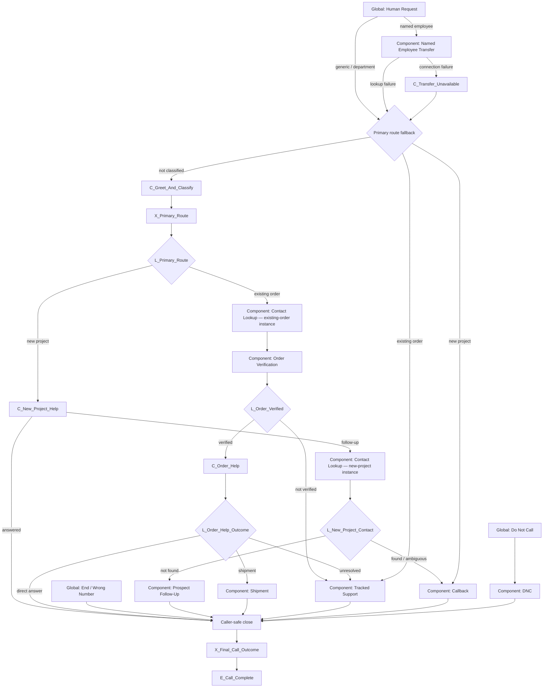

# GenStone Retell Agent Build Specification

This is the authoritative Retell implementation guide for the initial GenStone
customer agent. It translates the
[capability map](./genstone-capability-map.md) and
[tool contracts](./tool-contract-catalog.md) into a buildable Retell
Conversation Flow.

This file defines graph structure, Retell node types, variables, transitions,
tool placement, knowledge boundaries, launch speech settings, and tests. It
does **not** contain the finished global prompt or finished node prompt copy.

## Build Target

Create one phone-capable **Conversation Flow** agent.

| Retell setting | Initial decision |
| --- | --- |
| Response engine | Conversation Flow |
| Flex Mode | Off |
| Tool-call strict mode | On |
| Language | English |
| Start speaker | Agent |
| Begin message | “Thank you for calling GenStone. Are you calling about a new project or existing order?” |
| Components | Dedicated versioned GenStone shared subflows; never reuse across agents or edit in place |
| Per-node model overrides | None initially; add only after a failing node is isolated in testing |
| Code, SMS, MCP, Press Digit, Agent Transfer | Do not add |
| Human phone transfer | Standard warm transfer with human detection and a private whisper, for an explicitly named active employee only |

Use visual notes on the canvas to label the main router, new-project path,
existing-order path, global interruptions, and result handling. Retell's API
returns ids for shared subflows but does not expose a usable id for embedded
local definitions. The approved API build therefore uses GenStone-only,
release-versioned shared subflows. Treat each shared id as immutable, never
attach it to another agent, and create a new versioned set for every changed
release so later edits cannot alter live behavior.

## Prompt Boundary

The future production prompt owns tone, persona, phrasing, and universal
guardrails. This build spec owns deterministic behavior.

Until prompt copy is approved, node instructions should be short instruction
contracts that state:

- the one outcome the node must achieve;
- which facts it may use;
- which values it must collect or confirm;
- what it must not claim;
- what transition should happen after the caller responds.

Do not paste tool contracts, internal routing addresses, provider details, or
the entire capability map into every node. The global prompt should eventually
contain only universal behavior shared by all nodes.

## Naming Convention

Use these prefixes so Retell history is easy to scan:

| Prefix | Retell type | Example |
| --- | --- | --- |
| `C_` | Conversation | `C_Order_Help` |
| `X_` | Extract DV | `X_Order_Confirmation` |
| `L_` | Logic Split | `L_Order_Lookup_Result` |
| `F_` | Function | `F_Lookup_Order` |
| `T_` | Call Transfer | `T_Named_Employee` |
| `G_` | Global-enabled Conversation | `G_Human_Request` |
| `E_` | End | `E_Call_Complete` |

Names describe the action or result. Do not use generic names such as `Step 4`,
`Tool`, `Success`, or `Fallback`.

## Dynamic Variables

Retell provides `{{call_id}}`, `{{user_number}}`, `{{agent_number}}`, and
`{{call_type}}`. Use `{{user_number}}` as the initial caller-number candidate;
it is not automatically confirmed.

Do not initialize extracted caller fields to empty strings because Retell's
`exists` condition treats an empty string as present. Initialize only status and
outcome fields to explicit values such as `not_run`. Prefer exact enum/status
comparisons over `exists` checks.

### Conversation variables

| Variable | Type | Allowed values or purpose |
| --- | --- | --- |
| `primary_route` | Enum | `new_project`, `existing_order`, `other` |
| `caller_name` | Text | Confirmed or caller-supplied name |
| `confirmed_phone` | Text | Number confirmed for lookup or callback |
| `caller_email` | Text | Caller-supplied email when needed |
| `caller_type` | Enum | `customer`, `contractor`, `distributor`, `retail_partner`, `other` |
| `caller_country` | Text | Country when known; do not guess |
| `communication_preference` | Text | Ordinary follow-up context only |
| `project_summary` | Text | Minimum useful new-project context |
| `postal_code` | Text | Optional project context |
| `prospect_confirmed` | Boolean | Caller confirmed contact and project summary before internal follow-up |
| `order_identifier_type` | Enum | `caller_phone`, `alternate_phone`, `order_number` |
| `order_identifier` | Text | Lookup value; keep order numbers as Text |
| `order_items_confirmed` | Boolean | Caller confirmed candidate order items |
| `order_email_confirmed` | Boolean | Caller confirmed candidate order email |
| `order_verified` | Boolean | True only when both confirmations are true |
| `order_help_outcome` | Enum | `direct_answer`, `shipment`, `tracked_support` |
| `shipment_email_requested` | Boolean | Caller accepted or requested shipment email |
| `support_summary` | Text | Short factual description of the issue |
| `support_summary_confirmed` | Boolean | Caller confirmed the factual support summary |
| `callback_subject` | Text | Broad caller-confirmed topic |
| `callback_summary` | Text | Short factual summary |
| `callback_date` | Text | Caller-requested calendar date |
| `callback_time` | Text | Caller-requested local time, normalized by backend |
| `callback_phone` | Text | Confirmed callback number |
| `callback_confirmed` | Boolean | Caller confirmed the read-back |
| `urgency_context` | Text | Facts for internal priority context; no service promise |
| `requested_employee_name` | Text | Name independently supplied by caller |
| `transfer_confirmed` | Boolean | Caller confirmed transfer after employee match |
| `dnc_phone` | Text | Number the caller confirmed for suppression |
| `dnc_confirmed` | Boolean | Explicit do-not-call confirmation |
| `capability_gap_summary` | Text | Unsupported request captured for follow-up and QA |

### Tool-result variables

Initialize every status below to `not_run`:

| Variable | Written by | Purpose |
| --- | --- | --- |
| `contact_lookup_status` | `lookup_contact` | `found`, `not_found`, `ambiguous`, `validation_failed`, `error` |
| `contact_token` | `lookup_contact` | Opaque internal contact reference |
| `order_lookup_status` | `lookup_order` | `found`, `not_found`, `ambiguous`, `validation_failed`, `error` |
| `order_candidate_token` | `lookup_order` | Opaque candidate order reference; not proof of verification |
| `order_item_summary` | `lookup_order` | Caller-safe item summary used for confirmation |
| `order_email_masked` | `lookup_order` | Masked email hint used for confirmation |
| `order_status_summary` | `lookup_order` | Caller-safe stored order status; speak only after verification |
| `shipment_lookup_status` | `lookup_shipment` | `found`, `shipment_unavailable`, `error` |
| `shipment_safe_summary` | `lookup_shipment` | Verified carrier/tracking/stored shipped-date summary |
| `shipment_email_status` | `email_shipment_tracking` | `sent`, `shipment_unavailable`, `delivery_failed`, `error` |
| `case_write_status` | `create_support_case` | `created`, `created_notice_failed`, `validation_failed`, `error` |
| `callback_status` | `schedule_callback` | `scheduled`, `invalid_day_or_time`, `delivery_failed`, `error` |
| `prospect_followup_status` | `send_prospect_follow_up` | `sent`, `delivery_failed`, `validation_failed`, `error` |
| `employee_lookup_status` | `lookup_active_employee` | `found`, `not_found`, `ambiguous`, `missing_number`, `error` |
| `employee_display_name` | `lookup_active_employee` | Safe matched employee name for transfer confirmation |
| `employee_transfer_target` | `lookup_active_employee` | E.164 number or SIP target used only by the transfer node |
| `dnc_status` | `suppress_phone_number` | `suppressed`, `already_suppressed`, `validation_failed`, `error` |
| `call_outcome` | `X_Final_Call_Outcome` or Retell transfer result | `answered`, `shipment_emailed`, `callback_scheduled`, `support_follow_up`, `prospect_follow_up`, `transferred`, `dnc`, `ended`, `tool_failure` |

Never speak opaque tokens, internal addresses, direct employee numbers,
provider errors, or raw function results. Dynamic variables and metadata appear
in Retell call records; never put API keys or other credentials in them.

## Standard Custom-Function Configuration

Create the functions named in the
[tool contract catalog](./tool-contract-catalog.md). Unless a route has a
documented exception, configure each one as follows:

| Setting | Value |
| --- | --- |
| Method | `POST` |
| URL | Worker base URL plus the catalog route |
| Payload | Args only |
| Content type | `application/json` |
| Authentication | Static `Authorization: Bearer …` header using the Retell-scoped Worker key; never a dynamic variable |
| Retell signature | Worker verifies `X-Retell-Signature` against the exact raw body before parsing |
| Wait for Result | On |
| Speak During Execution | Optional short static sentence; never announce success before the result |
| Retell retries | Disabled where configurable; do not rely on a provider retry count |
| Backend writes | Idempotent using the supplied idempotency key |
| Response size | Small caller-safe JSON only |

Every request includes `call_id: "{{call_id}}"`. Every write includes an
idempotency key such as `"{{call_id}}:schedule_callback"`. A corrected retry is
the same logical action unless the backend contract explicitly creates a new
version.

Return this common shape:

```json
{
  "ok": true,
  "result_code": "found",
  "safe_summary": "Caller-safe summary when applicable",
  "data": {}
}
```

Map `result_code` into the tool's status variable. Map only the specific
`data` fields listed above. A missing mapping must take an Else/error edge; it
must never become success. Function nodes explain nothing themselves—route to
a Conversation node after the result is available.

Tools used inside an Agent Component must be defined in that Component; Retell
does not expose Component-owned tools on the main canvas. Keep each tool in the
one Component that owns its action. When the same component is used from two
routes, place two instances of that Component on the main canvas so each
instance can have the correct outgoing edge.

### Function argument bindings

Bind these as constants from confirmed dynamic variables. Do not let the LLM
invent opaque tokens, confirmation booleans, or idempotency keys.

| Function | Required bound arguments |
| --- | --- |
| `lookup_contact` | `call_id={{call_id}}`, `phone={{confirmed_phone}}`, optional confirmed `email={{caller_email}}` |
| `lookup_order` | `call_id`, `identifier_type={{order_identifier_type}}`, `identifier={{order_identifier}}` |
| `lookup_shipment` | `call_id`, `order_candidate_token`, `order_items_confirmed`, `order_email_confirmed`, `order_verified` |
| `lookup_active_employee` | `call_id`, `employee_name={{requested_employee_name}}` |
| `schedule_callback` | `call_id`, idempotency key, constant `primary_route=new_project`, `caller_name`, `callback_subject`, `callback_summary`, `callback_date`, `callback_time`, `callback_phone`, `callback_confirmed`, optional preference and urgency context |
| `send_prospect_follow_up` | `call_id`, idempotency key, constant `primary_route=new_project`, confirmed contact fields, `project_summary`, optional `postal_code`, `prospect_confirmed` |
| `email_shipment_tracking` | `call_id`, idempotency key, `order_candidate_token`, both order-confirmation booleans, `order_verified`, `shipment_email_requested` |
| `create_support_case` | `call_id`, idempotency key, constant `primary_route=existing_order`, `order_candidate_token` when present, caller name, confirmed phone, caller type, country when known, `support_summary`, `support_summary_confirmed`, and optional preference/photo/urgency context |
| `suppress_phone_number` | `call_id`, idempotency key, `dnc_phone`, `dnc_confirmed` |

The shipment-email backend resolves the actual destination from the order
candidate token. The support backend determines internal routing and internal
email recipients. Internal sender/recipient and transactional-message routing
is typed product source configuration, not environment configuration. Retell
never supplies either recipient address.

## Main Canvas

Build the main canvas in this order. Component result nodes write their status
variables before returning to the main flow.



| Node | Type | Required behavior and outgoing edges |
| --- | --- | --- |
| `C_Greet_And_Classify` | Conversation; start node | Use the approved begin message. Let the caller answer naturally. Prompt edges: new project → `X_Primary_Route`; existing order → `X_Primary_Route`; Else stays and asks one focused clarification. |
| `X_Primary_Route` | Extract DV | Write `primary_route`. Always → `L_Primary_Route`. |
| `L_Primary_Route` | Logic Split | `new_project` → `C_New_Project_Help`; `existing_order` → Contact Lookup component; Else → `C_Clarify_Request`. |
| `C_Clarify_Request` | Conversation | If the primary route is not known, ask whether this is a new project or existing order. Then identify a verified answer or the route's one follow-up outcome. Do not invent a department or tool. |
| `X_Capability_Gap` | Extract DV | Write `capability_gap_summary`. Always → `L_Capability_Gap`. |
| `L_Capability_Gap` | Logic Split | `primary_route == new_project` → Callback; `primary_route == existing_order` → Tracked Support; Else → `C_Greet_And_Classify`. |
| `C_New_Project_Help` | Conversation + approved KB | Answer approved public/product knowledge. Prompt edge when fully answered → `C_Close_Answered`; prompt edge when information must be answered later → Contact Lookup. |
| `L_New_Project_Contact` | Logic Split after Contact Lookup | `not_found` → Prospect Follow-Up. `found` or `ambiguous` → Callback when follow-up is needed. Error → safe failure close. |
| `L_Prospect_Component_Result` | Logic Split after Prospect Follow-Up | `prospect_followup_status == sent` → caller-safe prospect close; Else → tool-failure close. |
| `L_Existing_Contact` | Logic Split after Contact Lookup | All outcomes continue to Order Verification. Salesforce context does not replace or block WooCommerce verification. |
| `L_Order_Verified` | Logic Split after Order Verification | `order_verified == true` → `C_Order_Help`; Else → Tracked Support without speaking protected order details. |
| `C_Order_Help` | Conversation | Ask how the agent can help. If the caller already explained the issue, repeat it back instead. Use prompt edges to `X_Order_Help_Outcome`. |
| `X_Order_Help_Outcome` | Extract DV | Write one of the three `order_help_outcome` values. Always → `L_Order_Help_Outcome`. |
| `L_Order_Help_Outcome` | Logic Split | Route to direct answer, Shipment, or Tracked Support. Else → `C_Clarify_Request`. Existing-order callback is not an edge. |
| `C_Order_Direct_Answer` | Conversation | Speak only verified WooCommerce data or approved knowledge. Never infer ETA, delivery, approval, inventory, or an outcome. Then → `C_Close_Answered`. |
| `L_Shipment_Result` | Logic Split after Shipment component | `shipment_lookup_status == found` and email declined/not requested → answered close; `shipment_email_status == sent` → answered close; `shipment_unavailable` → Tracked Support; Else → tool-failure close. |
| `L_Support_Result` | Logic Split after Tracked Support component | `case_write_status == created OR created_notice_failed` → `C_Close_Support_Followup`; validation/error → safe tool-failure close without claiming follow-up was recorded. |
| `L_Callback_Component_Result` | Logic Split after Callback component | `callback_status == scheduled` → `C_Close_Callback`; otherwise → `C_Close_Tool_Failure`. |
| `L_DNC_Component_Result` | Logic Split after DNC component | `dnc_status == suppressed OR already_suppressed` → `C_Close_DNC`; otherwise → tool-failure close. |
| `C_Transfer_Unavailable` | Conversation | Tell the caller the connection could not be completed, then return to the primary-route fallback. Do not claim the employee declined or is unavailable. |
| `C_Close_Answered` | Conversation | Briefly summarize the verified answer and close naturally. Then → `X_Final_Call_Outcome`. |
| `C_Close_Callback` | Conversation | Confirm only the accepted date, Mountain time, and callback number. Never mention internal email. Then → `X_Final_Call_Outcome`. |
| `C_Close_Support_Followup` | Conversation | Say the customer service team will respond by the end of the next business day. Never say case or ticket, and do not offer an appointment time. Then → `X_Final_Call_Outcome`. |
| `C_Close_DNC` | Conversation | Confirm the do-not-call request was handled only after `suppressed` or `already_suppressed`. Then → `X_Final_Call_Outcome`. |
| `C_Close_Tool_Failure` | Conversation | Do not claim the action succeeded. Apologize briefly and preserve the requested context for QA. Then → `X_Final_Call_Outcome`. |
| `X_Final_Call_Outcome` | Extract DV | Write exactly one `call_outcome` enum from the completed path and tool statuses. Always → `E_Call_Complete`. Transfer success is recorded from Retell's transfer result because the original graph does not resume. |
| `E_Call_Complete` | End | End only after the caller-facing result or next step has been stated. |

## Agent-Local Components

### Confirm Contact And Look Up Salesforce

Use this component only when CRM context or follow-up information is needed.
Simple public questions do not require contact collection.

1. `C_Confirm_Caller_Number`: Offer `{{user_number}}` as the lookup number and
   ask whether it is correct. If not, collect the replacement. Collect name or
   email only when useful for the pending outcome.
2. `X_Contact_Details`: Write `confirmed_phone`, `caller_name`, and
   `caller_email` when supplied.
3. `C_Read_Back_Contact`: Confirm the minimum lookup fields; correction loops
   to the collection node.
4. `F_Lookup_Contact`: Call `lookup_contact`; map status and opaque contact
   token. Do not announce Salesforce use or its result.
5. `L_Contact_Result`: Every recognized result exits the component. Else maps
   to `error` and exits.

### Verify WooCommerce Order

This component implements the required existing-order verification gate.

1. `F_Lookup_Order_By_Phone`: Use `confirmed_phone`, falling back to the
   caller-confirmed `{{user_number}}`. Set identifier type `caller_phone`.
2. `L_First_Order_Lookup`: `found` → candidate confirmation; `not_found` or
   `ambiguous` → alternate identifier; validation/error → alternate identifier.
3. `C_Collect_Alternate_Order_Identifier`: Ask for a different phone number or
   numeric WooCommerce order number. Do not ask for both. A retailer, store,
   Pro Desk, PO, or CPO number that is not the WooCommerce order number is
   context only and cannot be used as a lookup or verification factor.
4. `X_Alternate_Order_Identifier`: Write identifier type and value.
5. `F_Lookup_Order_By_Alternate`: Make one bounded second lookup.
6. `L_Second_Order_Lookup`: `found` → candidate confirmation; all other results
   set `order_verified=false` and exit to normal follow-up.
7. `C_Confirm_Order_Candidate`: State the caller-safe item summary and ask the
   caller to confirm it. Ask the caller to confirm the masked order-email hint;
   never volunteer a full email address.
8. `X_Order_Confirmation`: Write the two confirmation booleans and
   `order_verified`. True requires both confirmations. A correction returns to
   alternate identifier; a denial exits unverified.
9. `L_Order_Confirmation`: Explicit true → exit verified. Else → exit
   unverified.

`lookup_order` returns `order_candidate_token`; it does not declare the caller
verified. Every downstream order, shipment, or support function receives the
candidate token plus `order_verified=true`, and the backend fails closed when
verification is absent.

Retailer-context orders use this same component. If the normal phone or numeric
WooCommerce order lookup does not find a verifiable record, exit unverified to
Tracked Support. Do not add a retailer-specific node, tool, or portal
integration.

### Send Prospect Follow-Up

This component is valid only when `primary_route == new_project` and Salesforce
contact lookup returned `not_found`.

1. `C_Collect_Project_Context`: Collect the minimum useful project summary and
   optional ZIP. Do not conduct a quote or create a CRM record.
2. `X_Project_Context`: Write the summary and ZIP.
3. `C_Confirm_Project_Context`: Read back the contact and short summary.
4. `X_Prospect_Confirmation`: Write `prospect_confirmed`; correction returns
   to collection and decline exits without sending.
5. `F_Send_Prospect_Followup`: Call `send_prospect_follow_up` only when
   `prospect_confirmed=true`.
6. `L_Prospect_Write_Result`: Store the returned status and exit the Component.
   Never mention the internal recipient.

### Handle Shipment Request

1. `F_Lookup_Shipment`: Require `order_verified=true` and the candidate token.
2. `L_Shipment_Lookup`: `found` → shipment answer; `shipment_unavailable` →
   Tracked Support; Else → tool-failure result.
3. `C_Shipment_Answer_And_Email_Offer`: Speak only the returned safe summary.
   If the caller asked when it will arrive, clearly distinguish stored tracking
   information from an unavailable live ETA. Offer the shipment email.
4. `X_Shipment_Email_Request`: Write `shipment_email_requested`.
5. `L_Shipment_Email_Request`: False → exit successfully after spoken answer;
   true → email confirmation.
6. `C_Confirm_Order_Email_For_Shipment`: Confirm the masked order email. Do not
   accept an alternate recipient.
7. `X_Shipment_Email_Confirmation`: Update `order_email_confirmed`.
8. `L_Shipment_Email_Confirmation`: True → send; false → return to confirmation
   or exit without sending.
9. `F_Email_Shipment_Tracking`: Call `email_shipment_tracking`. The backend
   resolves the actual recipient from the verified order token.
10. `L_Shipment_Email_Result`: `sent` → confirm the email was requested
    successfully; delivery failure/error → do not claim it was sent.

### Create Tracked Support

This single component covers returns, warranties, claims, damage, missing or
wrong items, and other matters requiring owned resolution.

1. `C_Collect_Support_Summary`: Collect a short factual summary. Do not ask
   about photos by default. Preserve volunteered photo availability and
   communication preference as ordinary context.
2. `X_Support_Summary`: Write summary and optional context.
3. `C_Confirm_Support_Summary`: Confirm the factual issue summary, not the
   internal action.
4. `X_Support_Confirmation`: Write `support_summary_confirmed`; correction
   returns to collection and decline exits without writing.
5. `F_Create_Support_Case`: Call `create_support_case` only when
   `support_summary_confirmed=true`. The backend assigns the Support group with
   no individual assignee, normal priority, native Type `Question`, Ticket Type
   `Answering Service`, and explicit tag `answer_connect`. Populate Customer
   Name, Phone, caller type, and Country when known; field option values supply
   sortable tags such as `answering_service` and `customer`. The backend sends
   the required internal case-created email after the ticket is created. The
   component never searches, compares, selects, or updates an earlier ticket.
6. `L_Case_Write_Result`: `created` → support-follow-up close.
   `created_notice_failed` still means the support ticket
   exists; use the same caller language and let the backend retry/alert
   internally. Validation/error → safe failure without scheduling a Callback.

At launch, Zendesk uses an internal integration/service requester, private
comments, and no customer-facing Zendesk notifications. Keep requester mode,
comment visibility, and notification behavior centrally configurable so a
later business decision does not require a Retell-flow change. The Retell
component never intentionally sends a customer support email.
The caller-facing close states that customer service responds by the end of the
next business day. This is an SLA-style expectation, not a callback booking.

### Schedule Centralized Callback

This component is valid only when `primary_route == new_project`. The backend
must reject attempts to schedule an existing-order callback.

1. `C_Collect_Callback_Request`: Propose a broad subject based on the existing
   conversation and let the caller correct it. Collect preferred day, time, and
   callback phone. Earliest is next business day; Monday-Friday, 8:30 AM-4:30
   PM Mountain time; standard U.S. federal holidays are unavailable.
2. `X_Callback_Request`: Write subject, summary, date, time, phone,
   communication preference, and factual urgency context.
3. `C_Confirm_Callback_Request`: Read back subject, date, Mountain time, and
   phone. Do not offer or promise a particular coordinator.
4. `X_Callback_Confirmation`: Write `callback_confirmed`.
5. `L_Callback_Confirmation`: True → schedule; correction → collection; decline
   → exit without scheduling.
6. `F_Schedule_Callback`: Call `schedule_callback` with the bound constant
   `primary_route=new_project`.
7. `L_Callback_Write_Result`: `scheduled` → success exit;
   `invalid_day_or_time` → collection; delivery/error → failure exit.

Customer.io sends this request internally. The application does not send the
caller a callback confirmation email.

### Resolve Named Employee And Transfer

Enter only when the caller independently supplies an employee name.

1. `X_Requested_Employee`: Write `requested_employee_name` from what the caller
   already said. Do not ask a generic human requester to choose a person.
2. `F_Lookup_Active_Employee`: Call `lookup_active_employee`.
3. `L_Employee_Result`: `found` → transfer confirmation; `not_found`,
   `ambiguous`, `missing_number`, or `error` → primary-route fallback.
4. `C_Confirm_Named_Transfer`: Confirm the safe display name and ask whether to
   transfer. Do not say the employee is available.
5. `X_Transfer_Confirmation`: Write `transfer_confirmed`.
6. `L_Transfer_Confirmation`: True and `{{call_type}} == "phone_call"` →
   transfer; false → return to prior help; web-call handling is out of scope.
7. `T_Named_Employee`: Set destination to
   `{{employee_transfer_target}}`. Never speak or display the target in a
   Conversation node. Configure **standard warm transfer**, human detection,
   auto-greeting, and a private whisper to the employee before the caller is
   bridged. Use Retell's default 30-second human-detection timeout. Set the
   transfer caller ID to **User's Number** so the Twilio transfer presents the
   customer's number to the employee. Keep three-way introduction off unless
   separately approved.
8. The private whisper should identify this as a GenStone call, give the
   matched employee name, and include only the caller's name and broad topic
   when known. Do not whisper full order, email, payment, or other unnecessary
   sensitive details.
9. Connect the built-in transfer-failure edge to
   `C_Transfer_Unavailable`. After telling the caller the connection could not
   be completed, enter the primary-route fallback with the conversation context
   preserved.

Do not create separate transfer nodes per employee. A Salesforce lookup
failure goes directly to the primary-route fallback; an attempted connection
failure first uses `C_Transfer_Unavailable` so the caller understands why the
original transfer was not completed.

GenStone uses Twilio. Retell supports presenting the customer's number on a
Twilio warm transfer when caller ID is set to **User's Number**. Verify the
display with one live transfer test before launch.

### Record Do-Not-Call

1. `C_Confirm_DNC_Number`: Confirm `{{user_number}}`, or collect the specific
   number the caller wants suppressed.
2. `X_DNC_Request`: Write `dnc_phone` and `dnc_confirmed`.
3. `L_DNC_Confirmation`: True → suppress; correction → confirmation; false →
   return or close without writing.
4. `F_Suppress_Phone`: Call `suppress_phone_number`.
5. `L_DNC_Write_Result`: Store the returned status and exit the Component. The
   main-canvas result split decides whether success may be stated.

This component writes only to Five9 and never creates a CRM or Zendesk record.

## Global Nodes

Configure these as global-enabled Conversation nodes. Add positive and negative
fine-tuning examples and enable the default three-step immediate re-trigger
prevention where a caller can return to the prior flow.

| Global node | Trigger | Behavior |
| --- | --- | --- |
| `G_Human_Request` | Caller clearly asks for a human, employee, or department | If the caller already names an employee, enter Named Employee Transfer. Otherwise follow `primary_route`: new project → Callback; existing order → Tracked Support; not classified → opening classification. Do not ask a generic requester to choose a name or department. Enable return-to-previous when the caller changes their mind and asks the agent to continue. |
| `G_Do_Not_Call` | Caller explicitly asks GenStone to stop calling or remove a number | Enter DNC confirmation. Do not treat frustration alone as DNC. No return-to-previous after successful suppression. |
| `G_End_Call` | Caller clearly wants to end the call or says it is a wrong number | Close politely and end. Do not trigger from a pause, uncertainty, or background speech. |

Silence is not a global node. Configure Retell's silence reminders and end-call
setting separately.

## Knowledge Base Placement

Create one initial knowledge base named `GenStone Approved Public Knowledge`.
Seed it only with reviewed material from
[Approved public knowledge](./approved-public-knowledge.md) and specifically
approved product references.

- Attach it to `C_New_Project_Help` and other Conversation nodes that answer
  public product/process questions.
- Do not attach it to Function, confirmation, callback, support-write, DNC, or
  transfer nodes.
- Do not upload transcripts, the external-systems research reference, tool
  contracts, internal email addresses, credentials, or historical GenSteel
  prompts.
- Do not crawl the entire website as launch knowledge. A public page is not
  authoritative for live inventory, order data, eligibility, or a promised
  outcome.

Start with Retell's documented retrieval guidance of three chunks and a `0.60`
similarity threshold, then tune only when tests show a missed or irrelevant
answer. Do not compensate for a bad knowledge source by adding longer prompts.

## Global Settings And Call Operations

Use the current GenSteel review-agent settings as the initial measured baseline.
An unset value means Retell's default; do not invent a numeric override.

| Setting | Initial value | Build instruction |
| --- | --- | --- |
| Voice | `retell-Brynne` | Re-test clarity for order numbers, names, and older callers before production approval. |
| Voice model | Retell default | Leave unset. |
| Voice temperature | `1` | Copy the GenSteel baseline. |
| Voice speed / volume | `1` / `1` | Copy the GenSteel baseline. |
| Default LLM | Cascading `gpt-5.2`, high priority | Use for every node initially; no per-node override until a specific failure is demonstrated. |
| LLM temperature | `0.2` | Keep stable and low-variance. |
| Responsiveness | `0.7` | Copy the GenSteel baseline, then test with normal and slower callers. |
| Interruption sensitivity | `0.6` | Copy the GenSteel baseline, then test against store and call-center background speech. |
| Backchanneling | Retell default | Leave enablement, frequency, and words unset initially. A backchannel is a brief listening acknowledgement such as “mm-hmm”; it must not be mistaken for confirmation. |
| Silence reminder | Retell default | Leave the reminder trigger and maximum count unset initially. A reminder is a spoken check-in after caller inactivity; it is separate from ending the call. |
| End after silence | `50,000 ms` | End a no-response call after 50 seconds; never route silence to support or callback. |
| Maximum call duration | `600,000 ms` | Ten-minute operational limit. |
| Ambient sound | `call-center` | Copy the GenSteel baseline; remove only if call testing shows it hurts clarity. |
| Boosted keywords | Initially unset | These bias speech recognition toward easily misheard proper nouns; they do not add knowledge. Add only a tested, maintained list of GenStone, approved product/color names, retailer names, common spoken SKUs, carriers, and frequently requested employee names. Never add customer identifiers. |
| Pronunciation dictionary | Initially unset | Add a rule only after the voice mispronounces a confirmed brand, product, acronym, or employee name in testing. Confirm the intended pronunciation of `GenStone` before adding it. Useful candidates to test include SKU, PO, CPO, UPS, USPS, and product/color names. |
| Speech normalization | Enabled | Test phone numbers, order numbers, dates, times, email spelling, and money. |
| Webhook | Signed GenStone webhook | Processing must be idempotent. |
| Retell data storage | `Everything` | Retell retains recordings, transcripts, logs, dynamic variables, and normal call artifacts. This is separate from the Worker's full-webhook archive. |
| Retell webhook archive | Private R2 plus PlanetScale pointer | Archive the exact authenticated webhook body in `CALL_ARCHIVE_BUCKET`. Store its object key, checksum, size, and state in PlanetScale; do not duplicate the full payload in SQL. |
| Retention | Keep; no automatic deletion | Retell keeps call artifacts, R2 has no lifecycle-expiration rule for webhook payloads, and PlanetScale has no scheduled cleanup for operational records. |

### Speech-control meanings

- **Backchannel frequency** controls how often the agent makes short listening
  acknowledgements while the caller is speaking. It does not control answer
  length or response speed. Leave it unset initially.
- A **silence reminder** is a spoken check-in after the caller has not spoken
  for a configured interval. It is independent of the 50-second silence
  hang-up timer. Leave its trigger and count unset to inherit Retell's default.
- **Boosted keywords** bias speech-to-text toward likely proper nouns and terms;
  they do not teach the agent facts or behavior. Keep the launch list empty,
  then add only terms shown to be misrecognized in call testing.
- **Pronunciation rules** change how the selected voice says written terms;
  they do not improve caller transcription. Keep the launch dictionary empty,
  then add business-confirmed phonetic rules only for terms the voice actually
  mispronounces.

## Post-Call Analysis And Gap Capture

Do not build a call-history lookup tool. Retell post-call analysis may capture:

- primary route;
- `call_outcome`;
- whether order verification succeeded;
- callback, support, shipment-email, transfer, or DNC outcome;
- tool failure name/status;
- `capability_gap_summary` when the agent could not handle the request.

These fields support transcript review and agent improvement. They do not
create new customer records, new caller paths, or permission to retain data
beyond approved policy.

## Retell Mechanics References

The Retell-specific behavior in this specification follows the official guides
for [Conversation Flow](https://docs.retellai.com/build/conversation-flow/overview),
[Function nodes](https://docs.retellai.com/build/conversation-flow/function-node),
[custom functions and response variables](https://docs.retellai.com/build/conversation-flow/custom-function),
[dynamic variables](https://docs.retellai.com/build/dynamic-variables),
[Components](https://docs.retellai.com/build/conversation-flow/components),
[Global nodes](https://docs.retellai.com/build/conversation-flow/global-node),
[knowledge bases](https://docs.retellai.com/build/knowledge-base), and
[Call Transfer](https://docs.retellai.com/build/conversation-flow/call-transfer-node).

## Required Tests Before Publishing

| Area | Minimum test |
| --- | --- |
| Opening | New project, existing order, ambiguous answer, and caller starts by explaining the whole problem |
| Public knowledge | Approved answer succeeds; unsupported product question routes to follow-up without guessing |
| Salesforce contact | Found, not found, ambiguous, and error; existing-order route continues to WooCommerce in every case |
| Order verification | Caller number match; alternate phone; order number; no match; wrong items; wrong email; both confirmations required |
| Order privacy | Agent never reveals full email, another order, opaque tokens, or status before verification |
| Shipment | Speak stored details; no stored shipment; caller declines email; caller accepts email; attempted alternate recipient; delivery failure |
| Support | Every confirmed unresolved existing-order call creates one new private ticket; created notice succeeds; `created_notice_failed`; write error does not schedule callback; Support group; no assignee; Type `Question`; Ticket Type `Answering Service`; `answer_connect`, `answering_service`, and caller-type tags; Customer Name, Phone, caller type, and Country mapping; end-next-business-day wording |
| Photos | Caller volunteers photos; agent records context but does not invent an upload link or separate path |
| Callback | Next business day; reject same day, weekend, holiday, before 8:30, and after 4:30 Mountain; correct phone; declined confirmation; email failure |
| Human request | Generic human request follows the primary route without asking for a department: new project → Callback; existing order → Zendesk |
| Named transfer | Active unique employee success with private whisper; inactive/not found; ambiguous; missing number; caller declines; warm-transfer timeout/failure returns to the agent; Twilio displays customer-number caller ID; web-call fallback |
| DNC | Caller number; different number; caller correction; already suppressed; failure; frustration that is not a DNC request |
| Unsupported request | New-project Callback or existing-order Zendesk is used and capability gap is captured; no new tool is improvised |
| Tool integrity | Timeout, malformed result, missing response variable, interruption during write, and duplicate write never produce false success |
| Retailer orders | Normal WooCommerce record by phone or numeric order succeeds; retailer/PO/CPO-only identifier remains context; unmatched existing order uses Zendesk without claiming retailer-system access |
| Scope guard | SMS preference, support photos, receipt/payment request, and call-history question do not create new scenarios |

Test transfers on a phone call; Retell's Call Transfer node does not operate in
web calls. For every Logic Split, test the Else edge. For every Conversation
and Global node, add both transition and do-not-transition examples from real
or synthetic call language.

## Publish Checklist

- [ ] The main start node and all Component Begin/Exit connections are valid.
- [ ] Flex Mode is off and tool-call strict mode is on.
- [ ] Every Function node waits for its result.
- [ ] Every tool status is mapped from `result_code` and has an Else/error edge.
- [ ] Every write is confirmed and idempotent.
- [ ] No order result is spoken before both verification confirmations.
- [ ] The shipment email resolves only to the verified order email.
- [ ] Zendesk creation also triggers the internal case-created email.
- [ ] Existing-order follow-up never asks for a callback day or time.
- [ ] Zendesk receives the confirmed sorting fields and tags, and the caller is
      told customer service responds by the end of the next business day.
- [ ] Generic human requests do not solicit an employee or department.
- [ ] The named transfer uses standard warm transfer, human detection, and the private employee whisper.
- [ ] The transfer caller-ID setting is **User's Number** and a live Twilio test confirms what the employee sees.
- [ ] The named transfer failure edge reaches `C_Transfer_Unavailable`, tells
      the caller the connection failed, and then returns to the primary-route
      fallback.
- [ ] No SMS, MCP, Code, Press Digit, Agent Transfer, payment, or upload-link node exists.
- [ ] Only approved knowledge is attached to answer nodes.
- [ ] The complete test matrix passes in draft and the published version is
      pinned for production use.

## Decisions That Still Gate Production

None from the business and storage decisions documented here.

Zendesk is confirmed as internal-only at launch. The Retell transfer mode and
initial speech/model baseline are also confirmed. They still require draft call
testing, including one live transfer test that verifies the caller ID presented
by the connected phone carrier.
