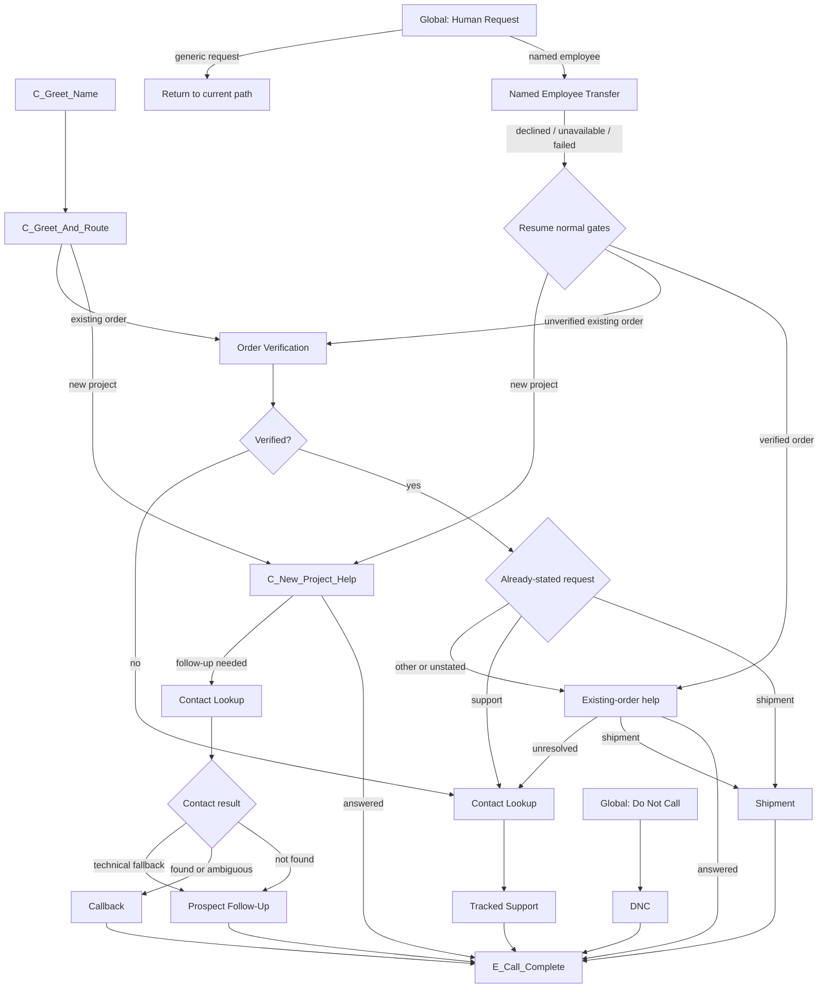

# GenStone Retell Agent Build Specification

This is the authoritative Retell implementation guide for the initial GenStone
customer agent. It translates the
[capability map](./genstone-capability-map.md) and
[tool contracts](./tool-contract-catalog.md) into a buildable Retell
Conversation Flow.

This file defines graph structure, Retell node types, variables, transitions,
tool placement, knowledge boundaries, launch speech settings, and tests. It
does **not** contain the finished global prompt or finished node prompt copy.

## Build Target

Create one phone-capable **Conversation Flow** agent.

| Retell setting | Initial decision |
| --- | --- |
| Response engine | Conversation Flow |
| Flex Mode | Off |
| Tool-call strict mode | On |
| Language | English |
| Start speaker | Agent |
| Begin message | “Thank you for calling GenStone. Who do I have the pleasure of speaking with?” |
| Components | Dedicated versioned GenStone shared subflows; never reuse across agents or edit in place |
| Per-node model overrides | None initially; add only after a failing node is isolated in testing |
| Code, SMS, MCP, Press Digit, Agent Transfer | Do not add |
| Human phone transfer | Standard warm transfer with human detection and a private whisper, for an explicitly named active employee only |

Use visual notes on the canvas to label the main router, new-project path,
existing-order path, global interruptions, and result handling. Retell's API
returns ids for shared subflows but does not expose a usable id for embedded
local definitions. The approved API build therefore uses GenStone-only,
release-versioned shared subflows. Treat each shared id as immutable, never
attach it to another agent, and create a new versioned set for every changed
release so later edits cannot alter live behavior.

## Prompt Boundary

The future production prompt owns tone, persona, phrasing, and universal
guardrails. This build spec owns deterministic behavior.

Until prompt copy is approved, node instructions should be short instruction
contracts that state:

- the one outcome the node must achieve;
- which facts it may use;
- which values it must collect or confirm;
- what it must not claim;
- what transition should happen after the caller responds.

Do not paste tool contracts, internal routing addresses, provider details, or
the entire capability map into every node. The global prompt should eventually
contain only universal behavior shared by all nodes.

## Graph Design Rule

Use Retell nodes for business boundaries, not for every sentence.

- A shared path defaults to one multi-turn **Subagent node** plus one exit.
- The Subagent owns fact collection, caller corrections, confirmation, and its
  allowed tools.
- Use an owned Extract Dynamic Variable tool inside the Subagent when the
  backend needs structured caller facts.
- Keep backend result branches on the main canvas only when they prevent a
  false success statement or enforce a different business outcome.
- Add a non-speaking Extract, Function, or Branch node only when Retell must
  enforce an atomic boundary before generated speech: confirmed contact before
  lookup, confirmed write data before mutation, or phone channel before
  transfer.
- Do not add separate Conversation, Extract, Branch, and Function nodes for
  each turn in one ordinary interaction.
- Do not perform final-outcome or capability-gap extraction during the call.
  Retell post-call analysis owns those reporting fields.
- Create a new immutable version of every shared component and the main flow
  for each deployed change.

The current release uses these prefixes:

| Prefix | Purpose |
| --- | --- |
| `C_` | Main multi-turn conversation or caller-safe close |
| `S_` | Shared-component Subagent |
| `L_` | Backend-result branch that changes the business outcome |
| `G_` | Global interruption |
| `E_` | Exit or end |

## Dynamic Variables

Retell supplies `{{call_id}}`, `{{user_number}}`, `{{agent_number}}`, and
`{{call_type}}`. The caller number is an initial candidate, not confirmed
identity.

Only status fields are initialized to `not_run`. Caller-provided fields are
created when captured; do not initialize them to empty strings.

Caller facts used by the active components are:

- contact: `caller_name`, `confirmed_phone`, and `caller_email` once a path
  requires it or phone-only Salesforce lookup does not find a unique contact;
- order: `order_identifier_type`, `order_identifier`,
  `order_items_confirmed`, `order_verified`;
- new project: `project_summary`, confirmed `caller_email`, optional volunteered
  `postal_code`;
- shipment: `shipment_email_requested`, `shipment_email`;
- support: `support_summary`, `caller_type`, confirmed `caller_email`,
  optional country, preference, photo, and urgency context;
- callback: subject, summary, date, time, phone, email, and `callback_confirmed`;
- transfer: `requested_employee_name`, `transfer_confirmed`;
- DNC: `dnc_phone`, `dnc_confirmed`.

Tool-result statuses are `contact_lookup_status`, `order_lookup_status`,
`shipment_lookup_status`, `shipment_email_status`, `case_write_status`,
`callback_status`, `prospect_followup_status`,
`employee_lookup_status`, and `dnc_status`.

Never speak opaque references, direct employee numbers, internal addresses,
provider errors, raw tool results, JSON, field names, or dynamic-variable
names.

## Tool Configuration

Custom tools are Component-owned and use the Worker routes in the
[tool contract catalog](./tool-contract-catalog.md).

- Send `POST` JSON with arguments at the root.
- Authenticate with the Retell-scoped Worker bearer key.
- Bind trusted tokens, route guards, confirmations, and idempotency keys as
  constants from dynamic variables; do not let the language model invent them.
- Let the custom tool own one short static execution sentence.
- Do not speak again after execution from a separate Function node.
- Map only approved caller-safe response fields.
- Backend writes remain idempotent and fail closed.
- A missing or failed result never becomes caller-facing success.

## Current Main Flow

The start node asks only for the caller's name. The next node asks whether the
call concerns a new project or existing order. That routing node handles its
own clarification.

`C_New_Project_Help` must try to answer from approved knowledge before
follow-up. Existing-order calls verify the WooCommerce order before Salesforce
contact lookup. The order subagent uses one handoff sentence—“Great. What can I
help you with?”—without separately announcing verification. A silent branch
immediately after the shared-component exit routes any request answered during
that handoff. This boundary is required because Retell can receive the caller's
answer before the shared component has finished exiting. The existing-order
help node handles other requests and asks the open help question only when the
subagent did not already do so.
Salesforce phone/email lookup runs only when customer-service support is
needed. It never blocks shipment answers or collects contact information for a
shipment-only call.

Each focused subagent owns its tool result and caller-safe success or failure
language. Successful components and answered conversations go directly to the
Retell end node, which owns the single goodbye. The main canvas branches only
when the result changes the next business path.

## Shared Components

Every component below is one focused Subagent plus one exit. The Subagent owns
fact capture, corrections, confirmation, its narrowly scoped tools, and the
caller-safe result. Backend schemas, idempotency, order-reference validation,
quote exclusion, and write guards remain authoritative.

### Contact Lookup

Reuse `confirmed_phone` when it already exists. Otherwise, ask whether the
number ending in the last four digits of `{{user_number}}` is the best number
for GenStone to use. Do not read the full caller-ID number. Accept at most one
replacement and do not read it back. Caller ID alone is not confirmation.
The Contact Lookup Subagent calls the silent phone lookup once. If it returns
`not_found` or `ambiguous`, it asks for and confirms email once, then calls the
silent email lookup. Do not request email after a technical lookup error or
announce Salesforce. For existing orders this component runs only immediately
before Tracked Support, never before order verification or shipment handling.
When phone lookup finds a unique contact, do not announce that internal result.
Ask for and confirm the email already required by the follow-up path, then
continue. This prevents a lookup-only turn from becoming caller-facing CRM
narration.

### Order Verification

Confirm the order phone using only the caller-ID number's last four digits,
then use the confirmed phone for the first lookup. If the result is `not_found`,
`ambiguous`, or `validation_failed`, ask once for either another phone or
the GenStone order number and make one second lookup. A technical error does
not justify requesting another identifier.

Caller-supplied phones and order numbers are normal strict custom-tool
arguments. Do not bind them to dynamic-variable constants that may still be
unset inside the same Subagent turn. Retell sends the caller-confirmed value
directly; the Subagent also captures the confirmed phone for later shipment or
support tools.

The Order Verification Subagent says, “Thank you. Just give me a moment to look
up your order,” and owns the silent primary, alternate, and next-candidate
tools. Do not create separate announcement, extraction, function, or branch
nodes for each candidate turn.

After item confirmation, it says only “Great. What can I help you with?” and
waits for the caller. It does not say that the order was verified. The silent
main-flow branch after component exit treats delivery timing—including how long
samples will take to arrive—as shipment and invokes the verified shipment tool
instead of answering from generic public shipping guidance.

Exclude quote-status drafts from phone and exact order-number lookup. For a
candidate, identify a stored sample order or explicitly signaled retail order,
then use a fixed sentence that speaks the safe item summary once and asks
whether it matches. Use natural quantities such as “Chicago” or “20 units of
Chicago Panel,” never the multiplication symbol. Verification is true when the
items match. Email is not part of universal order verification.

If the caller rejects the first candidate, ask for the GenStone order number
once. If the caller has no order number, remember that answer and never ask for
it again during the call. Continue through the remaining recent non-quote
phone-matched orders until one is confirmed or none remain, then use the
unresolved-order support path. A rejected candidate is never attached to
Zendesk. When the caller already clearly stated the unresolved issue, reuse it
instead of asking for another description.

### Prospect Follow-Up

For an unmatched new-project caller, collect the confirmed email and only the
minimum missing project context, then call `send_prospect_follow_up` once the
request is clear. Do not ask for ZIP unless volunteered, repeat other contact
details, or require a formal project-summary confirmation. This is internal
follow-up, not CRM creation.

### Shipment

Call `lookup_shipment` immediately; never ask for a tracking number. Speak only
the concise returned summary and never read tracking numbers aloud. Offer to
email the complete tracking details. Only if accepted, ask which email address
to use, confirm that destination once, then call `email_shipment_tracking`.

### Tracked Support

The Tracked Support Subagent reuses the caller's existing issue, identity, and
verified order context. It asks one open question only when the issue is still
unclear. For unexplained damage, respond empathetically and ask “What was
broken?” It confirms email only when missing, captures the short factual
summary, and calls `create_support_case` once. Never repeat order items or
attach rejected order context.

After a successful write, use one fixed caller-facing sentence: “I'm letting
our team know, and they'll be in touch as soon as possible.” Do not read a
summary back, repeat order items or contact details, expose internal case
terminology, or add another support questionnaire.

The backend creates a new private Zendesk answering-service ticket and sends
the internal case-created email. This is not a customer email. The backend does
not search for, select, or update an older ticket. The Zendesk ticket id is
stored in internal execution and outcome records but is removed from the tool
response returned to Retell.

If the Zendesk write fails, say specifically that the information could not be
sent to customer service. Do not use the generic phrase “unable to complete
that request” and do not claim that follow-up was created.

### Callback

This component is new-project only. Reuse the already-confirmed phone; ask for
one only when none exists. Collect the confirmed email, broad subject,
preferred weekday/date, and Mountain time from 8:30 AM through 4:30 PM. The
earliest date is the next business day, excluding U.S. federal holidays.
Confirm the subject, date, time, use of the confirmed number, and email once.
After the caller approves, call `schedule_callback`. Do not repeat the details
again in the closing, promise a coordinator, or send a customer confirmation
email.

### Named Employee Transfer

Use only when the caller independently names an employee. Always call
`lookup_active_employee`, including on web calls.

- Employee lookup is restricted server-side to active Salesforce Users in the
  GenStone, GenStone Manager, or GenStone Remote Access profiles who have a
  direct phone number.
- The same Subagent performs lookup for every channel. A web call explains
  that the channel cannot make a live connection and returns to normal help.
- A phone call with one active match confirms the safe employee name and asks
  permission before invoking its owned transfer tool.
- The transfer is standard warm, uses human detection, plays the private
  whisper when connected, and shows the caller's number to the employee.
- Lookup failure, caller decline, unsupported channel, or transfer failure
  returns to normal new-project help/callback or existing-order support.
- Never speak the direct number or imply that the employee declined.

### DNC

Confirm the exact phone and the do-not-call request once, then call
`suppress_phone_number`. Frustration alone is not consent to suppress a
number.

## Global Nodes

- Human request: a named employee uses Named Employee Transfer. A generic
  request does not prompt the caller to choose a person or department and does
  not jump around the verification or routing gates. The agent returns to the
  current business path and continues helping.
- Do not call: enter DNC only for an explicit suppression request.
- End or wrong number: close and end without creating work.

Silence reminders and silence hang-up behavior remain agent settings, not
global nodes.

## Knowledge Base Placement

Create one initial knowledge base named `GenStone Approved Public Knowledge`.
Seed it only with reviewed material from
[Approved public knowledge](./approved-public-knowledge.md) and specifically
approved product references.

- Attach it to `C_New_Project_Help` and other Conversation nodes that answer
  public product/process questions.
- Do not attach it to Function, confirmation, callback, support-write, DNC, or
  transfer nodes.
- Do not upload transcripts, the external-systems research reference, tool
  contracts, internal email addresses, credentials, or historical GenSteel
  prompts.
- Do not crawl the entire website as launch knowledge. A public page is not
  authoritative for live inventory, order data, eligibility, or a promised
  outcome.

Start with Retell's documented retrieval guidance of three chunks and a `0.60`
similarity threshold, then tune only when tests show a missed or irrelevant
answer. Do not compensate for a bad knowledge source by adding longer prompts.

## Global Settings And Call Operations

Use the current GenSteel review-agent settings as the initial measured baseline.
An unset value means Retell's default; do not invent a numeric override.

| Setting | Initial value | Build instruction |
| --- | --- | --- |
| Voice | `retell-Brynne` | Re-test clarity for order numbers, names, and older callers before production approval. |
| Voice model | Retell default | Leave unset. |
| Voice temperature | `1` | Copy the GenSteel baseline. |
| Voice speed / volume | `1` / `1` | Copy the GenSteel baseline. |
| Default LLM | Cascading `gpt-5.5`, high priority | Use for every node initially; no per-node override until a specific failure is demonstrated. |
| LLM temperature | `0.2` | Keep stable and low-variance. |
| Responsiveness | `0.7` | Copy the GenSteel baseline, then test with normal and slower callers. |
| Interruption sensitivity | `0.6` | Copy the GenSteel baseline, then test against store and call-center background speech. |
| Backchanneling | Retell default | Leave enablement, frequency, and words unset initially. A backchannel is a brief listening acknowledgement such as “mm-hmm”; it must not be mistaken for confirmation. |
| Silence reminder | Retell default | Leave the reminder trigger and maximum count unset initially. A reminder is a spoken check-in after caller inactivity; it is separate from ending the call. |
| End after silence | `50,000 ms` | End a no-response call after 50 seconds; never route silence to support or callback. |
| Maximum call duration | `600,000 ms` | Ten-minute operational limit. |
| Ambient sound | `call-center` | Copy the GenSteel baseline; remove only if call testing shows it hurts clarity. |
| Boosted keywords | Initially unset | These bias speech recognition toward easily misheard proper nouns; they do not add knowledge. Add only a tested, maintained list of GenStone, approved product/color names, retailer names, common spoken SKUs, carriers, and frequently requested employee names. Never add customer identifiers. |
| Pronunciation dictionary | Initially unset | Add a rule only after the voice mispronounces a confirmed brand, product, acronym, or employee name in testing. Confirm the intended pronunciation of `GenStone` before adding it. Useful candidates to test include SKU, PO, CPO, UPS, USPS, and product/color names. |
| Speech normalization | Enabled | Test phone numbers, order numbers, dates, times, email spelling, and money. |
| Webhook | Signed GenStone webhook | Processing must be idempotent. |
| Retell data storage | `Everything` | Retell retains recordings, transcripts, logs, dynamic variables, and normal call artifacts. This is separate from the Worker's full-webhook archive. |
| Retell webhook archive | Private R2 plus PlanetScale pointer | Archive the exact authenticated webhook body in `CALL_ARCHIVE_BUCKET`. Store its object key, checksum, size, and state in PlanetScale; do not duplicate the full payload in SQL. |
| Retention | Keep; no automatic deletion | Retell keeps call artifacts, R2 has no lifecycle-expiration rule for webhook payloads, and PlanetScale has no scheduled cleanup for operational records. |

### Speech-control meanings

- **Backchannel frequency** controls how often the agent makes short listening
  acknowledgements while the caller is speaking. It does not control answer
  length or response speed. Leave it unset initially.
- A **silence reminder** is a spoken check-in after the caller has not spoken
  for a configured interval. It is independent of the 50-second silence
  hang-up timer. Leave its trigger and count unset to inherit Retell's default.
- **Boosted keywords** bias speech-to-text toward likely proper nouns and terms;
  they do not teach the agent facts or behavior. Keep the launch list empty,
  then add only terms shown to be misrecognized in call testing.
- **Pronunciation rules** change how the selected voice says written terms;
  they do not improve caller transcription. Keep the launch dictionary empty,
  then add business-confirmed phonetic rules only for terms the voice actually
  mispronounces.

## Post-Call Analysis And Gap Capture

Do not build a call-history lookup tool. Retell post-call analysis may capture:

- primary route;
- `call_outcome`;
- whether order verification succeeded;
- callback, support, shipment-email, transfer, or DNC outcome;
- tool failure name/status;
- `capability_gap_summary` when the agent could not handle the request.

These fields support transcript review and agent improvement. They do not
create new customer records, new caller paths, or permission to retain data
beyond approved policy.

## Retell Mechanics References

The Retell-specific behavior in this specification follows the official guides
for [Conversation Flow](https://docs.retellai.com/build/conversation-flow/overview),
[Subagent nodes](https://docs.retellai.com/build/conversation-flow/node),
[Function nodes](https://docs.retellai.com/build/conversation-flow/function-node),
[custom functions and response variables](https://docs.retellai.com/build/conversation-flow/custom-function),
[dynamic variables](https://docs.retellai.com/build/dynamic-variables),
[Components](https://docs.retellai.com/build/conversation-flow/components),
[Global nodes](https://docs.retellai.com/build/conversation-flow/global-node),
[knowledge bases](https://docs.retellai.com/build/knowledge-base), and
[Call Transfer](https://docs.retellai.com/build/conversation-flow/call-transfer-node).

## Required Tests Before Publishing

| Area | Minimum test |
| --- | --- |
| Opening | New project, existing order, ambiguous answer, and caller starts by explaining the whole problem |
| Public knowledge | Approved answer succeeds; unsupported product question routes to follow-up without guessing |
| Salesforce contact | New-project found, not found, ambiguous, and error; existing-order shipment does not request Salesforce email; existing-order support performs phone-first lookup and email fallback before Zendesk |
| Order verification | Caller number match; replacement phone without read-back; exact non-quote order number; quote excluded; no match; wrong items; item confirmation required; technical error does not request another identifier |
| Order privacy | Agent never reveals another order, opaque tokens, status before verification, mask characters, JSON, tool arguments, field names, or software provider names |
| Shipment | Speak concise status without tracking numbers; no stored shipment; caller declines email; caller accepts and confirms a destination email; delivery failure |
| Support | Every unresolved existing-order request creates one new private ticket without repeating contact details or requiring a summary read-back; created notice succeeds; `created_notice_failed`; write error does not schedule callback; Support group; no assignee; Type `Question`; Ticket Type `Answering Service`; `answer_connect`, `answering_service`, and caller-type tags; Customer Name, Phone, inferred caller type, volunteered Country mapping; end-next-business-day wording |
| Callback | Next business day; reject same day, weekend, holiday, before 8:30, and after 4:30 Mountain; correct phone; declined confirmation; email failure |
| Human request | Generic human request returns to the current path without asking for a department; failed named transfer resumes normal new-project or existing-order gates without jumping directly to Callback or Zendesk |
| Named transfer | Active unique employee success with private whisper; inactive/not found; ambiguous; missing number; caller declines; warm-transfer timeout/failure returns to the agent; Twilio displays customer-number caller ID; web-call fallback |
| DNC | Caller number; different number; caller correction; already suppressed; failure; frustration that is not a DNC request |
| Unsupported request | New-project Callback or existing-order Zendesk is used and capability gap is captured; no new tool is improvised |
| Tool integrity | Timeout, malformed result, missing response variable, interruption during write, and duplicate write never produce false success |
| Retailer orders | Normal WooCommerce record by phone or numeric order succeeds; retailer/PO/CPO-only identifier remains context; unmatched existing order uses Zendesk without claiming retailer-system access |
| Scope guard | SMS preference, receipt/payment request, and call-history question do not create new scenarios |

Test transfers on a phone call; Retell's Call Transfer node does not operate in
web calls. For every Logic Split, test the Else edge. For every Conversation
and Global node, add both transition and do-not-transition examples from real
or synthetic call language.

## Publish Checklist

- [ ] The main start node and all Component Begin/Exit connections are valid.
- [ ] Flex Mode is off and tool-call strict mode is on.
- [ ] Every shared responsibility is one focused Subagent plus one exit unless
      an explicit atomic-boundary exception is documented.
- [ ] Each tool execution has one speaking owner and no duplicate graph-level
      announcement.
- [ ] Every tool status is mapped from `result_code` and handled inside its
      responsible Subagent or a business-changing main branch.
- [ ] Every write is idempotent. Callback scheduling, shipment email, transfer,
      and DNC require caller approval; prospect and support internal follow-up
      use the caller's request as authorization without another ceremony.
- [ ] No order result is spoken before the caller confirms the candidate items.
- [ ] The shipment email resolves to the complete destination the caller confirmed.
- [ ] Zendesk creation also triggers the internal case-created email.
- [ ] Existing-order follow-up never asks for a callback day or time.
- [ ] Zendesk receives the confirmed sorting fields and tags, and the caller is
      told the team will be in touch as soon as possible.
- [ ] Generic human requests do not solicit an employee or department.
- [ ] The named transfer uses standard warm transfer, human detection, and the private employee whisper.
- [ ] The transfer caller-ID setting is **User's Number** and a live Twilio test confirms what the employee sees.
- [ ] The named-transfer Subagent tells the caller when connection fails and
      returns to the primary-route fallback.
- [ ] No SMS, MCP, Code, Press Digit, Agent Transfer, payment, or upload-link node exists.
- [ ] Only approved knowledge is attached to answer nodes.
- [ ] The complete test matrix passes in draft and the published version is
      pinned for production use.

## Decisions That Still Gate Production

None from the business and storage decisions documented here.

Zendesk is confirmed as internal-only at launch. The Retell transfer mode and
initial speech/model baseline are also confirmed. They still require draft call
testing, including one live transfer test that verifies the caller ID presented
by the connected phone carrier.
