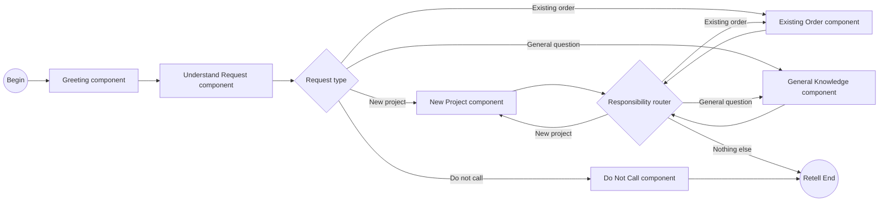
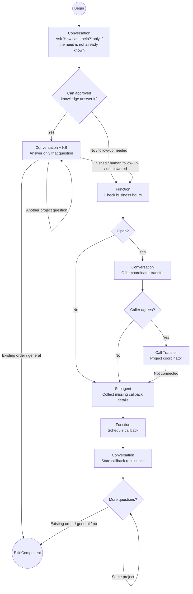
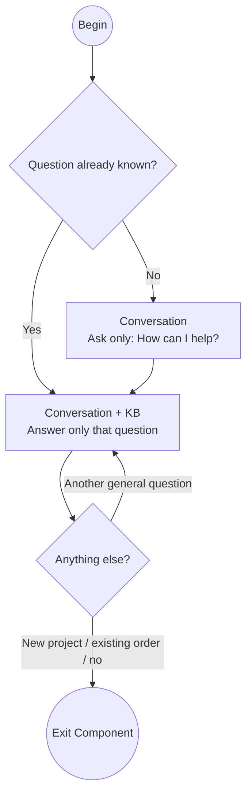
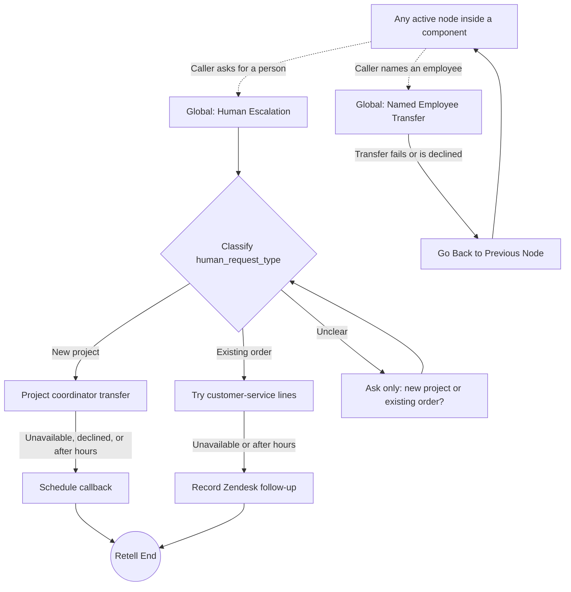
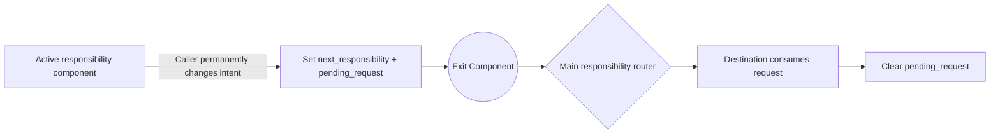

# GenStone Retell Agent Build Specification

This is the authoritative Retell implementation guide. The local `v74` build
in `retell/build-config.ts` implements this responsibility-component rebuild.
It adds explicit diagram-based canvas positions and visible Call Transfer nodes
instead of relying on Retell auto-layout or hiding transfers inside subagent
tools. It has not been applied to the published `v73` flow. The
[capability map](./genstone-capability-map.md) owns business behavior and the
[tool catalog](./tool-contract-catalog.md) owns backend contracts.

## Build Target

| Setting | Decision |
| --- | --- |
| Response engine | Conversation Flow |
| Release | `genstone_customer_agent_v74`; local candidate pending provider readback |
| Flex Mode | Off |
| Tool-call strict mode | On |
| Default model | Cascading `gpt-5.5`, high priority |
| Model temperature | `0.2` |
| Components | Six main-flow responsibility components plus generic-human and named-employee global interruptions |
| Knowledge | Node-scoped only; never global |
| Echo Verification | Off |
| Transfer | Standard warm, human detection, private whisper, caller number shown |

Keep the approved voice, storage, responsiveness, interruption, silence, call
duration, ambient sound, timezone, webhook, and post-call settings in
`buildAgentConfig` unchanged unless a measured failure supports a change.

The earlier unpublished `v66` draft is superseded because its nodes used
Retell's automatic canvas positions and its transfer actions were embedded in
subagent nodes. The unpublished `v67` and `v68` drafts were superseded by
`v69`, which keeps continuation inside each owning responsibility without
restarting New Project's transfer or callback sequence. Local `v74` supersedes
the currently published `v73` flow for the next deployment, as well as the
earlier unpublished `v66` through `v72` candidates.

Superseded `v67` provider draft:

- Agent: `agent_6361f738f0db11c11e28fcd410`
- Conversation Flow: `conversation_flow_dd94122b40ee`, version `0`
- Nine immutable `v67` components passed provider readback.
- Published: no
- Phone number bound: no
- Calls or simulations run: none

Superseded `v68` provider draft:

- Agent: `agent_8b046ee2a101562736f6822a9f`
- Conversation Flow: `conversation_flow_0716a0a4a349`, version `0`
- Eight immutable `v68` components passed provider readback.
- Published: no
- Phone number bound: no
- Calls or simulations run: none

Superseded `v69` provider draft used as the manual-edit starting point:

- Agent: `agent_4863348a135c633285041a504b`
- Conversation Flow: `conversation_flow_193ce1ce720d`, version `0`
- Eight immutable `v69` components passed provider readback.
- Published: no
- Phone number bound: no
- Calls or simulations run: none

## Ownership Rule

Each broad business responsibility lives in one focused component. Components
never contain other components and never link directly into another
component's internal nodes. Detailed operational steps remain inside the broad
component that owns them.

### Greeting component

- Say: “Thank you for calling GenStone. Who do I have the pleasure of speaking
  with?”
- Capture only the caller's name.
- If the caller responds with an explicit do-not-call request instead of a
  name, exit Greeting immediately so Understand Request can route DNC.

### Understand Request component

- Ask whether the call concerns a new project or an existing order.
- Return exactly one route: new project, existing order, general question, or
  do not call.
- This component is initial intake only. Responsibility components retain their
  own same-context follow-up questions.

### New Project component

One component owns both outcomes:

- open phone call: offer and perform the project-coordinator transfer;
- closed, web, declined, or failed transfer: collect missing callback facts and
  schedule the callback.

Callback collection and writing remain internal nodes of this component.

The component may answer the caller's stated question before offering the
coordinator transfer. It does not recite possible project topics or ask the
caller to choose a department. After callback handling, it keeps additional
questions about that same project inside New Project. It exits only for an
existing-order question, general question, or the end of the call.

`S_Project_Knowledge` is a knowledge-enabled Subagent with no external tools
and no Skip User Response edge. It remains active across same-project questions
and proceeds to transfer/callback handling only when the caller finishes those
questions, requests human follow-up, or approved knowledge cannot answer. A
genuine responsibility change enters a dedicated extraction node before the
component exits.

### Existing Order component

One component owns the complete existing-order conversation:

- identifier confirmation and WooCommerce candidate lookup;
- retained candidate iteration;
- caller confirmation of the correct order;
- a silent backend function that marks the accepted candidate verified;
- the caller's current request;
- shipment lookup and optional shipment email;
- direct knowledge or confirmed-data answers;
- customer-service escalation and transfer fallback;
- contact matching and Zendesk follow-up; and
- existing-order continuation.

After each handled request, ask whether the caller has other questions about
the existing order. A same-order question returns to current-request handling.
A different-order question clears verified-order state and returns to
identifier confirmation. Neither leaves the component.

A new-project or general request captures `next_responsibility` and one
`pending_request`. No more help leaves `next_responsibility` empty. The
component exits once, and the single main responsibility router selects the
next broad owner or ends the call.

### General Knowledge component

Use the approved Retell knowledge base only for an actual answer. The global
flow, intake, callback collection, contact collection, tool execution, and
closure have no knowledge retrieval.

General Knowledge answers additional general questions inside the same
component. It exits only when the caller changes to a new project or existing
order, or needs nothing else. It does not transfer, schedule callbacks, look up
orders, or create Zendesk follow-up.

### Do Not Call component

Use this only when Understand Request classifies a do-not-call request near the
start of the call. Confirm the phone number, record the suppression, and end
politely. Do not configure DNC as a global node.

## Call-Wide State and Global Interruptions

Retell dynamic variables are call-wide and remain available across the main
flow and component boundaries.

| Variable | Purpose |
| --- | --- |
| `caller_name` | Caller's known name from the greeting. |
| `caller_phone_last_four` | Last four caller-ID digits derived silently before Greeting. |
| `next_responsibility` | One-time responsibility handoff: new project, existing order, or general. |
| `pending_request` | One newly switched request passed to the destination owner and cleared immediately after that owner consumes it. |
| `order_verified` | Whether the active order was accepted by the caller and marked verified. |
| `order_candidate_token` | Backend reference for the active candidate or verified order. |
| `order_lookup_identifier_type` / `order_lookup_identifier` | The current caller-confirmed phone, email, or order number used only for order lookup. |
| `callback_phone` / `callback_email` | Contact details confirmed only for callback scheduling. |
| `shipment_email` | Destination confirmed only after the caller accepts a shipment email. |
| `support_phone` / `support_email` | Contact details confirmed only for support follow-up. |

Do not rely on undocumented component-boundary history inheritance to carry a
new request. Capture `pending_request` only when responsibility changes, use it
at the destination's first meaningful request node, then clear it with a silent
code node. Do not maintain `active_request_summary`, a rolling call-context
summary, or a separate `handoff_requested` flag. Callback and Zendesk tools
still receive one concise factual summary, generated from the available
conversation only when the tool is called.

Use exactly two global interruption paths. DNC is not global; Understand
Request routes it to the normal Do Not Call component.

- Named employee: look up the named employee and attempt the transfer. If the
  caller supplies a partial name that finds one eligible Salesforce User, use
  that result. If several Users match, ask once for the full name and retry. If
  the caller declines, no unique employee is found, or the transfer fails, use
  Go Back to Previous Node so the interrupted component resumes where it
  stopped.
- Generic human: permanently leave the interrupted responsibility, classify
  `human_request_type` once from the available conversation, complete either
  transfer or fallback, and end. Never use Go Back for this path.

Human Escalation owns its complete fallback. For a new project, transfer to
`303-876-4333` during business hours; otherwise schedule the callback. For an
existing order, try `303-647-1024` and `303-904-7205` during business hours;
otherwise record the Zendesk follow-up. A successful transfer leaves the AI
conversation through Retell's transfer behavior. A completed fallback proceeds
to Retell End and does not resume the interrupted component.

The Human Escalation global reuses the conversation already available in
Retell and collects only information missing from the selected fallback. The
Named Employee global is temporary: it alone may return to the interrupted
node. Neither global routes directly into another component's internal nodes.

Do not use a global node to switch ordinary business responsibilities. If an
existing-order caller changes to a new project, the Existing Order component
captures `next_responsibility` and `pending_request`, clears active-order state,
exits normally, and the single main responsibility router enters New Project.
This preserves one visible owner and avoids hidden concurrent routes.

## Implemented Rebuild Boundary

The local `v74` build:

- routes DNC from Understand Request into a normal subflow;
- uses a terminal generic Human Escalation global subflow;
- keeps Named Employee as the only Go Back transfer interruption;
- does not extract or route on `active_request_summary`;
- removes `current_context` and uses one-time `pending_request` handoffs;
- terminates callback delivery failures without claiming an internal alert
  succeeded when that outcome is not guaranteed;
- states callback success inside New Project's continuation instead of using a
  dedicated statement-and-skip node;
- consolidates callback failures into one terminal message;
- uses speaking component exits for terminal Human Escalation, Named Employee,
  and DNC outcomes;
- uses Understand Request only for initial intake;
- keeps same-context continuation inside New Project, Existing Order, and
  General Knowledge;
- routes all permanent responsibility changes through one
  `next_responsibility` router and immediately clears the one-time handoff at
  the destination;
- clears active-order state on a different-order request or permanent
  responsibility change;
- uses purpose-specific callback, shipment, support, and order-lookup contact
  variables;
- routes directly from each current tool result instead of persistent status
  variables;
- separates verified support writes from unverified human-escalation fallback;
- exposes only safe shipment/contact summaries to Retell while retaining full
  provider results privately;
- accepts one unique eligible employee from a partial-name Salesforce search,
  with one full-name clarification when several employees match;
- uses dedicated Extract Dynamic Variables nodes before deterministic routing
  or operational tools instead of letting extraction compete with a Subagent
  transition;
- returns unknown intake and human-request classifications to their owning
  question instead of defaulting to another responsibility; and
- keeps each knowledge answer and its continuation question in one interactive
  node rather than using an automatic Skip User Response transition.

Every main-flow and subflow node has an explicit display position. Transfer
operations are visible Call Transfer nodes with explicit failure edges, so the
Retell canvases follow the diagrams rather than appearing as auto-arranged
interconnected graphs.

## Email Confirmation

Do not enable global Echo Verification. Where an email is operationally
required, use this local rule:

> Spell every character of the complete email, say “at” and “dot,” and wait for
> confirmation before using it.

Email is collected only for callback scheduling, shipment email after consent,
or Zendesk follow-up. Keep confirmation scoped to that purpose; do not treat an
order-lookup email as already confirmed for callback, shipment, or support.

## WooCommerce Lookup Performance

WooCommerce is the only order system. Do not copy or synchronize customer-order
lookup data into PlanetScale. A successful WooCommerce search retains its
eligible candidates for the current call so moving to the next candidate does
not repeat the provider search.

## Tool and Speech Boundaries

- Custom tools live inside their owning component and are invisible outside it.
- Deterministic API actions use Function nodes with Wait for Result enabled.
- Each tool result has one caller-facing response owner.
- A write result must succeed before the agent describes its outcome.
- The agent never speaks provider names, raw errors, internal addresses,
  credentials, ticket ids, dynamic-variable names, or tracking numbers.
- Order lookup owns the one static wait sentence.
- Retell transfer tools own their one transfer announcement.
- Tool timeouts remain 30 seconds; there is no artificial eight-second provider
  timeout.

## Verification

Before deployment:

1. run Worker and Retell typechecks;
2. run unit/config tests;
3. run the Cloudflare dry-run build;
4. deploy the Worker;
5. create the immutable Retell draft and verify provider readback;
6. do not repin the live number until the owner approves the draft.

Do not run paid Retell simulations or demo calls without explicit approval.
