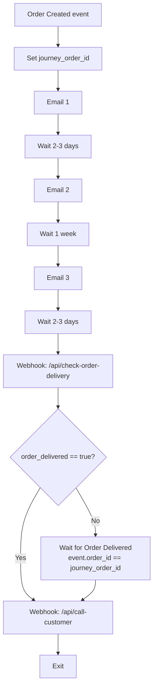
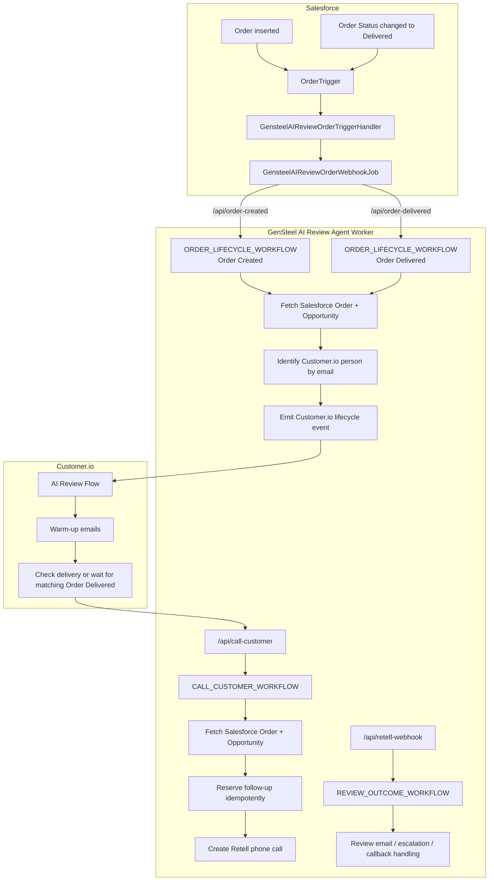

# API Setup

## Route Classes

| Route                      | Class                  | Auth                                                                         |
| -------------------------- | ---------------------- | ---------------------------------------------------------------------------- |
| `GET /health`              | Public health          | None.                                                                        |
| `POST /api/order-created`  | Salesforce/service route | `Authorization: Bearer $GENSTEEL_AI_REVIEW_AGENT_WORKER_API_KEY` or `x-salesforce-secret: $GENSTEEL_AI_REVIEW_AGENT_WORKER_API_KEY`. |
| `POST /api/check-order-delivery` | Salesforce/service route | `Authorization: Bearer $GENSTEEL_AI_REVIEW_AGENT_WORKER_API_KEY` or `x-salesforce-secret: $GENSTEEL_AI_REVIEW_AGENT_WORKER_API_KEY`. |
| `POST /api/order-delivered` | Salesforce/service route | `Authorization: Bearer $GENSTEEL_AI_REVIEW_AGENT_WORKER_API_KEY` or `x-salesforce-secret: $GENSTEEL_AI_REVIEW_AGENT_WORKER_API_KEY`. |
| `POST /api/call-customer` | Service route | `Authorization: Bearer $GENSTEEL_AI_REVIEW_AGENT_WORKER_API_KEY` or `x-salesforce-secret: $GENSTEEL_AI_REVIEW_AGENT_WORKER_API_KEY`. |
| `GET /api/test/orders`     | Internal/test route    | `Authorization: Bearer $GENSTEEL_AI_REVIEW_AGENT_WORKER_API_KEY`.            |
| `GET /api/test/calls`      | Internal/test route    | `Authorization: Bearer $GENSTEEL_AI_REVIEW_AGENT_WORKER_API_KEY`.            |
| `GET /api/test/orders/:id` | Internal/test route    | `Authorization: Bearer $GENSTEEL_AI_REVIEW_AGENT_WORKER_API_KEY`.            |
| `GET /api/test/web-call`   | Internal test page     | Browser page. Requires the Worker API key before it can create a call.        |
| `POST /api/test/web-call`  | Internal/test route    | `Authorization: Bearer $GENSTEEL_AI_REVIEW_AGENT_WORKER_API_KEY`.            |
| `POST /api/retell-webhook` | Provider webhook       | Retell `x-retell-signature` verified with `RETELL_WEBHOOK_SECRET_GENSTEEL`. Manual tests can use `Authorization: Bearer $RETELL_WEBHOOK_SECRET_GENSTEEL` or `x-retell-webhook-secret`. |

## Customer.io Warm-Up Flow

Customer.io campaign `AI Review Flow` (`CUSTOMERIO_AI_REVIEW_FLOW_CAMPAIGN_ID`)
enters on the `Order Created` event.

The draft campaign sequence is:

1. Set journey attribute `journey_order_id` from `event.order_id`.
2. Email 1 introduces Lisa from GenSteel as an AI assistant.
3. Wait 2-3 days.
4. Email 2 checks in on purchase clarity.
5. Wait 1 week.
6. Email 3 says Lisa will check in soon.
7. Wait 2-3 days.
8. Check `/api/check-order-delivery` and store `response.order_delivered` in
   journey attribute `order_delivered`.
9. If `order_delivered` is `true`, continue.
10. If not delivered, wait for `Order Delivered` where the delivered event
    `order_id` equals journey attribute `journey_order_id`.
11. Invoke the AI Review Agent Worker.

The final Customer.io webhook action is `Invoke AI Review Agent Worker`. It posts
to the deployed Worker `/api/call-customer` route with a top-level `data` object:

- `order_id`
- `opportunity_id`
- `order_email`

The `Invoke AI Review Agent Worker` and `Check Order Delivery` webhook actions
send `Authorization: Bearer $GENSTEEL_AI_REVIEW_AGENT_WORKER_API_KEY`.



## Order Lifecycle Worker Flow

The Worker validates either the service bearer token or the Salesforce shared
secret header and validates the payload.

Salesforce sends an ID-only payload to either lifecycle route:

```json
{
  "data": {
    "order_id": "801...",
    "opportunity_id": "006..."
  }
}
```

`POST /api/order-created` starts `ORDER_LIFECYCLE_WORKFLOW` with the
`Order Created` event name. It:

1. Records the `Order Created` payload in PlanetScale.
2. Fetches the full Salesforce `Order` through the Bradford Cloud Run
   Salesforce API.
3. Fetches the linked Salesforce `Opportunity` through the same Cloud Run API.
4. Resolves email, customer, account, delivery date, and status from real
   Salesforce fields.
5. Identifies the Customer.io person by email through the Track API.
6. Emits the Customer.io `Order Created` event to that same email identity.

`POST /api/order-delivered` starts the same `ORDER_LIFECYCLE_WORKFLOW` with the
`Order Delivered` event name. It:

1. Records the `Order Delivered` payload in PlanetScale.
2. Fetches the full Salesforce `Order` through the Bradford Cloud Run
   Salesforce API.
3. Fetches the linked Salesforce `Opportunity` when one is available.
4. Identifies the Customer.io person by email through the Track API.
5. Emits the Customer.io `Order Delivered` event to that same email identity.

Customer.io uses that event to release warm-up journeys waiting before the
`Invoke AI Review Agent Worker` action.

`POST /api/call-customer` starts `CALL_CUSTOMER_WORKFLOW`. It:

1. Records the call-customer request in PlanetScale.
2. Fetches the full Salesforce `Order` through the Bradford Cloud Run
   Salesforce API.
3. Fetches the linked Salesforce `Opportunity` through the same Cloud Run API.
4. Resolves phone, email, name, building type, account, contact, sales rep,
   delivery coordinator, and project coordinator from real Salesforce fields.
5. Reserves the order idempotently in PlanetScale.
6. Creates the Retell outbound call and stores the Retell `call_id`.

The Salesforce webhook intentionally sends only `order_id` and
`opportunity_id`. Phone, email, customer, building, sales rep, delivery
coordinator, and project coordinator details are enriched server-side.

Customer.io lifecycle identity is always the resolved customer email. Salesforce
Contact Id, Customer.io person id, account id, and order ids are sent as
attributes only; they are not used as the Track API customer id for this flow.

`POST /api/check-order-delivery` accepts the same ID-only payload and checks the
current Salesforce Order `Status` through the Bradford Salesforce API. It
returns:

```json
{
  "order_delivered": true
}
```

The Retell agent id comes from the handoff:

```text
agent_de8969556ad849660fb8dca417
```

## Workflow Model



## Retell Web-Call Test Flow

The GenStone prompt-management frontend exposes the preferred test UI at
`/gensteel-review`. That page uses authenticated Next.js API routes to proxy
calls into these protected Worker test endpoints, so the Worker service token is
never sent to the browser.

`GET /api/test/orders` lists recent General Steel review orders from Salesforce.
It accepts `days`, `limit`, and `q` query params. The backing Salesforce filter
is:

- `Building_Supplier_Order__c = 'General Steel'`
- `RecordTypeId = '0121U000000ZVPWQA4'`
- `CreatedDate = LAST_N_DAYS:{days}`

`GET /api/test/orders/:id` returns the selected order enriched with its linked
Opportunity and the normalized call inputs that the Retell flow will receive.
The response exposes building type/system fields already fetched from the
Salesforce Order and Opportunity.

`GET /api/test/calls` returns recent test follow-ups from the product schema
with `test_run_id`, `source_order_id`, `call_id`, outcome, workflow status, and
persisted outcome action statuses. Product SQL stays in the Worker persistence
service; the GenStone frontend reaches it only through its approved Next.js
proxy route.

`POST /api/test/web-call` creates a Retell web call from a real Salesforce
Order without buying or linking a phone number.

The optional `prompt_agent` field selects which Retell draft agent is used:

- `conversation_flow`: default. Uses `RETELL_AGENT_ID`.
- `multi_prompt`: uses `RETELL_MULTI_PROMPT_AGENT_ID`.

If `multi_prompt` is selected before `RETELL_MULTI_PROMPT_AGENT_ID` is set, the
route fails closed and returns the missing variable error from Retell call
creation.

`GET /api/test/web-call` serves a browser test page. The page keeps the Worker
API key in the browser only, posts to the protected test route, and uses
Retell's Web SDK to start the call with the returned access token.

The POST route:

1. Fetches the real Salesforce Order.
2. Fetches the linked Salesforce Opportunity.
3. Requires an explicit test recipient email in `customer_email`.
4. Generates a `test_run_id`.
5. Reserves a test-scoped follow-up row with `order_id = test_run_id`.
6. Stores the real Salesforce order as `source_order_id`.
7. Creates a Retell `/v2/create-web-call`.
8. Returns the Retell `callId`, browser `accessToken`, and `testRunId`.

This route does not write to Salesforce and does not reserve the real order as a
production follow-up. Retell test web-call metadata includes:

- `execution_mode = test`
- `prompt_agent`
- `test_run_id`
- `source_order_id`
- `source_order_number`
- `test_recipient_email`
- `test_escalation_email`
- `test_callback_delay_seconds`

The real order id is never used as the test idempotency key.

## Retell Webhook Flow

Retell sends `call_started`, `call_ended`, and `call_analyzed` events to
`/api/retell-webhook`.

Retell's agent webhook setting stores the route URL:

```text
https://gensteel-ai-review-agent.travis-m.workers.dev/api/retell-webhook
```

Production webhook delivery is verified with Retell's `x-retell-signature`
header and `RETELL_WEBHOOK_SECRET_GENSTEEL`.

The Worker records every webhook event. `call_analyzed` saves the call result,
posts a Slack call summary notification, and dispatches `REVIEW_OUTCOME_WORKFLOW`
for both production and test calls.

Test calls run the same outcome workflow path with test execution context:

- Customer.io review emails are sent only to `test_recipient_email`.
- Internal staff emails use the same staff recipient list and are marked
  `[TEST]` when the call is a test run.
- Callback waits use `test_callback_delay_seconds` when provided.
- Slack messages are marked `[TEST]`.
- Persistence rows include `execution_mode`, `test_run_id`, and
  `source_order_id`.
- Review template rotation uses separate test counters, so test runs do not
  consume production round-robin state.

The Workflow handles outcomes:

- `positive_review_email_needed`: select a DB-backed review template with
  round-robin counters, send a Customer.io transactional email, and persist the
  action. The templates are Customer.io transactional message
  ids `2` for ConsumerAffairs, `3` for Google, and `4` for BBB.
- `negative_escalation_needed`: mark the internal staff email as an escalation
  and persist the action.
- `callback_requested`: persist callback state and sleep until the parsed
  callback time when available.
- `wrong_person_or_number`: persist the outcome.
- `no_meaningful_conversation`: persist the outcome.
- `positive_no_review`: accepted only because the Retell handoff lists it as a
  possible value. It is persisted and Slack-notified, but has no customer email
  side effect.

Every outcome sends an internal staff email through the Cloudflare Email
Service. The email mirrors the Slack summary, includes Retell transcript/log and
recording links when Retell provides public URLs, and clearly marks
`negative_escalation_needed` as an escalation. For
`positive_review_email_needed`, the staff email includes a
`Trigger Giftcard Zapier Flow` link with the customer email, gift card type, and
selected review destination.

## Data Boundary

Browser clients do not call PlanetScale directly. Product persistence lives
behind the Worker API and uses the `gensteel_review_agent` schema.

## Provider Contracts

Retell, Customer.io, Cloudflare Email Service, and Slack are implemented
directly in service modules. Salesforce reads go through
`bradford-salesforce-api-endpoint`; no Salesforce write path is active in this
Worker.
